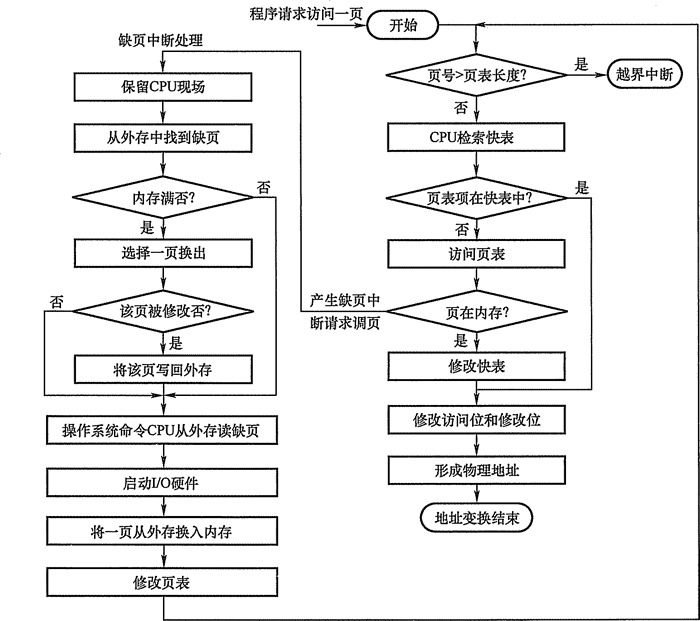

# 内存管理

## 功能

* 内存空间的分配与回收
* 地址转换
* 内存空间的扩充
* 存储保护

## 程序装入与链接

### 源代码运行步骤

1. 编译
2. 链接
3. 装入

### 链接方式

* 静态链接
* 装入时动态链接
* 运行时动态链接

### 装入方式

* 绝对装入：装入给定内存地址
* 可重定位装入（静态重定位）：对地址重定位后装入
* 动态运行时装入（动态重定位）：可在运行时重新进行重定位，需要重定位寄存器支持

## 逻辑地址与物理地址

* 逻辑地址/相对地址，程序只需要知道逻辑地址
* 物理地址，装入程序时，将逻辑地址映射为物理地址，称为地址重定位

## 内存保护

* 设置上下限寄存器，通过判断地址是否越界进行保护
* 采用**重定位寄存器（基址寄存器）**和**界地址寄存器（限长寄存器）**，重定位寄存器储存最小物理地址，界地址寄存器储存逻辑地址最大值

## 覆盖和交换

### 覆盖

* 将程序空间分为固定区和覆盖区，经常活跃的部分放在固定区，其余部分按调用关系分段（保证每一个覆盖区调用的覆盖段不会同时出现
* 程序运行时，将要访问的段放在覆盖段，需要调用其他段时，从外存将其调入覆盖

### 交换

* 把程序从内存移至辅存，称为换出
* 把程序由辅存中移入至内存，称为换入
* 注意点
  * 交换需要备份存储，一般使用快速磁盘
  * 进程使用实际应比交换时间（主要由转移时间影响）长，转移时间与交换的内存空间成正比
  * 换出进程时，进程应处于空闲状态
  * 交换空间应为独立于文件系统的磁盘空间的一整块
  * 交换在内存吃紧时使用，在系统负荷降低时暂停
  * 普通的交换使用不多，但交换的变体仍然在许多操作系统起作用

### 区别

* 交换发生在不同进程（或不同作业）间
* 覆盖则用于同一个程序或进程

## 连续分配管理方式

### 单一连续分配

* 将内存分为系统区和用户区
* 内存中只有一道程序，无需内存保护
* 优点
  * 简单
  * 无外部碎片
  * 可采用覆盖
* 缺点
  * 由内部碎片，存储器利用率低
  * 只能用于单用户、单任务的操作系统

### 固定分区分配

* 最简单的多道程序管理方式

* 将内存分为若干个固定大小的分区，每个分区只装入一个作业

* 分类

  * 分区大小相等，用于管理多个相同对象，不灵活
  * 分区大小不等，分为较多小分区，适量中等分区和少量大分区

* 优点

  * 无外部碎片

* 缺点

  * 程序可能放不进分区中，只能采用覆盖
  * 主存利用率低，有内部碎片

### 动态分区分配（可变分区分配）

* 需要多少内存就分配多少
* 从空闲分区中划分内存块给进程
* 算法
  * 首次适应算法（First Fit）：顺序查找分区，
  * 最佳适应算法（Best Fit）：查找第一个能满足要求的最小分区
  * 最坏适应算法（Worst Fit）：查找最大的分区
  * 临近适应算法（Next Fit）：又称循环首次适应算法，从上次查找结束的地方继续顺序查找
* 首次适应算法一般表现最好
* 优点
  * 无内部碎片
  * 分区可变
* 缺点
  * 有外部碎片
* 改进
  * 紧凑技术：移动进程使空闲分区彼此相邻

## 非连续分配管理方式

### 基本分页存储管理方式

* 页是物理划分
* 将内存分为大小相同的若干个小块，作为内存分配的基本单位
* 概念
  * 页：进程中的内存块
  * 页框/页帧：内存中的块
  * 地址结构：前半部分为页号P，后半部分为地址偏移量W
  * 页表：将页与物理内存进行映射
  * 页表项：页表的组成单位
* 页表寄存器：包含页表起始地址和长度
* 快表（相联存储器TLB）：
  * 快表属于cache的一种
  * 查询步骤
    1. 硬件解析出页号后，先与快表比对
    2. 若找到页表项，直接访问主存读取数据
    3. 若没找到，查询主存中的页表，并放入快表中，再访问主存读取数据
* 多级页表
* 段共享和保护
  * 共享：实现困难
  * 保护：
    * 越界保护
    * 访问权限控制
* 页是一维的
* 优点
  * 内存利用率高
  * 实现离散分配
  * 便于存储访问控制
  * 无外部碎片
* 缺点
  * 需要硬件支持
  * 内存访问效率下降
  * 共享困难
  * 内部碎片

### 基本分段式存储管理方式

* 段是逻辑划分
* 将内存空间分为若干个段
* 地址=段号+段内偏移
* 段表：每个段表项包含段号，段长和段起始地址
* 段共享和保护
  * 共享：段表项指向同一副本
  * 保护：共享段不能修改
* 段是二维的
* 优点
  * 便于程序模块化处理和处理变换的数据结构
  * 便于动态链接和共享
  * 无内部碎片
* 缺点
  * 需要硬件支持
  * 需要采用拼接减少外部碎片
  * 分段最大尺寸受可用空间限制
  * 外部碎片

### 段页式管理方式

* 也是二维的
* 地址=段号+页号+页内偏移量
* 段表只有一个，页表可以有多个
* 优点
  * 结合段式和页式的优点
* 缺点
  * 内部碎片多余页式存储
  * 无外部碎片

## 虚拟内存基本概念

### 传统存储管理特征

* 一次性：作业必须一次性加载入内存
  * 缺点
    * 作业很大时无法运行
    * 大量作业运行时，内存容量不足，只能运行部分程序，效率下降
* 驻留性：运行中的进程始终驻留在内存

### 局部性原理

* 时间局部性：被引用过一次的存储器位置在未来会被多次引用（通常在循环中）
* 空间局部性：如果一个存储器的位置被引用，那么将来他附近的位置也会被引用。

### 虚拟内存特征

* 多次性：作业无需一次性载入内存
* 对换性：作业无需一直驻留内存
* 虚拟性：用户看到的内存容量大于实际容量

### 实现方式

* 请求分页存储管理
* 请求分段存储管理
* 请求段页式存储管理

### 硬件支持

* 一定容量的内存和外存
* 页表机制（段表机制）
* 中断结构
* 地址变换结构

### 请求分页存储管理

#### 新增页表结构

* 状态位：该页是否调入内存
* 访问字段：该页在一定时间内被访问的次数或至今有多久未被访问
* 修改位：调入后是否被修改过
* 外存地址

#### 缺页中断

* 指令执行期间发生，属于内部中断
* 一条指令执行期间，可能会发生多次缺页中断

#### 地址变换结构

#### 页面置换算法

##### 最佳（OPT）置换算法

* 选择淘汰未来最长时间内不在访问的页面
* 无法实现

##### 先进先出（FIFO）页面置换算法

* 按顺序淘汰页面
* Belady异常
  * 只有FIFO会出现
  * 物理块数增加缺页率反而增加
  * 堆栈类算法不会出现
  * FIFO是队列算法

##### 最近最久未使用（LRU）置换算法

* 选择淘汰过去最久未被访问的页面
* 性能较好

##### 时钟（CLOCK）置换算法

* 步骤
  1. 增加一个使用位，每次页面被访问时，使用位置1
  2. 替换页面时，从上次淘汰页面的下一个位置开始遍历
  3. 若使用位为1，则置0，继续移动
  4. 直到查找找使用位为0的页面替换
  5. 若遍历一遍没有找到，则遍历第二遍

* 改进

  * 增加一个修改位，在选取页面时，按如下优先级选取，优先级最高的先替换

    | 优先级 | 访问位 | 修改位 |
    | ------ | ------ | ------ |
    | 4      | 0      | 0      |
    | 3      | 0      | 1      |
    | 2      | 1      | 0      |
    | 1      | 1      | 1      |

  * 遍历重置状态时，只重置访问位

  * 具体实现

    * 第一次查找（访问位=0，修改位=0），此时不修改访问位
    * 第二次查找（访问位=0，修改位=1），此时重置访问位
    * 查找两轮后，访问位必然全部为0，若还未找到，则再遍历一轮

##### 最不常用（LFU）置换算法

* 增加一个计数器，每次访问时，计数器加1
* 缺页时，淘汰计数器值最小的页面，计数器清零

##### 页面缓存（PBA）置换算法

* 使用两个缓存链表
  * 空闲页面链表
  * 修改页面链表
* 使用FIFO算法选择置换页，若修改过，放入修改链表尾部，若未修改，放入空闲链表尾部
* 缺页时，若页面存在于空闲链表或修改链表中，直接将其调入
* 若新页面不在链表中，则将空闲链表头部装入
* 修改链表达到一定数目后，将其写入磁盘，并放入空闲链表尾部

#### 页面分配策略

* 影响因素
  * 分配给一个进程越少页面，同时驻留在内存的进程就越多，提高系统效率
  * 分配给进程页面过少，页错误率较高
  * 分配页数过多，由于局部性原理，降低页错误率的效果很小
* 分配策略
  * 固定分配局部变换
    * 每个进程分配固定的内存块
    * 发生缺页时从该进程内的页面选一块调出
    * 缺点
      * 难以估计物理块数目
  * 可变分配全局变换
    * 发生缺页时，从全局空闲内存块选一个调入
    * 可从其他进程调出物理块
    * 缺点
      * 若盲目增加物理块，并发能力将降低
  * 可变分配局部变换
    * 发生缺页时，只从该进程本身调出物理块
    * 缺页率高时，增加物理块数目
    * 缺页率低时，减少物理块数目
    * 缺点
      * 实现复杂
* 调入策略
  * 请求调页策略：只有使用到该页时才调入
  * 预调页策略：掉页时把预计之后也会用到的页面一同调入

#### 何处调页

* 请求分页系统将外存分为两部分
  * 对换区：采用连续分配，速度快
  * 文件区：采用离散分配，速度慢
* 三种情况
  * 对换区足够：全部从对换区调页，在进程运行前，把有关文件全部复制到对换区
  * 对换区不足：不被修改的文件从文件区调入，被修改的文件在对换区调入调出
  * Unix方式：之前未运行过的页面从文件区调入，之后在对换区调入调出，若请求的共享页面已经位于内存，直接从对换区调入

#### 抖动

* 刚换出的页面马上要调入内存，这种频繁的页面调度称为抖动

#### 工作集

* 工作集指某段时间内进程要访问的页面集合
* 设工作集窗口大小为x，则在t时刻的工作集为，进程在t上课前访问的x个页面去重后的集合
* 进程分配的物理块大小应大于等于工作集大小，以避免抖动

### 地址翻译过程

1. 查找快表，若不命中，查找页表并将页表项载入快表，再访问快表
2. 获取内存地址后访问cache，若cache不命中，访问主存
3. 若页面不在主存中，访问外存

## 其他零散知识

* 处理完缺页中断后，还需访问快表来访问页表项