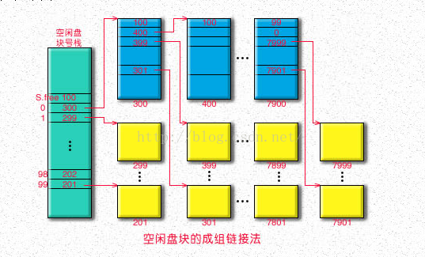

# 文件系统

## 文件结构

* 自底向上
  1. 数据项：文件的基本逻辑单元，不可再分的原子数据
  2. 记录：一组相关的数据项集合，代表一个对象的某方面属性
  3. 文件
     * 记录式文件（结构文件）：由记录构成
     * 无结构文件（流式文件）：可视为字节流

## 文件属性

* 名称：给用户看的名称
* 标识符：系统内部使用，用于标识文件
* 类型
* 位置
* 大小
* 保护
* 时间、日期和用户标识

## 文件分类

* 按用途
  * 系统文件
  * 库文件
  * 用户文件
* 按保护级别
  * 只读文件
  * 读写文件
  * 执行文件
  * 不保护文件

## 文件基本操作

* 创建文件
* 写文件
* 读文件
* 文件重定位：设置当前文件位置
* 删除文件
* 截断文件：仅清除文件内容
* 设置文件读写位置

## 文件打开和删除

### 打开文件

* 将文件读入内存，返回文件索引

* 关联信息
  * 文件指针
  * 文件打开计数
  * 文件磁盘位置
  * 访问权限

### 删除文件

* 删除文件索引
* 若文件修改，写回磁盘
* 销毁文件控制块

## 文件的逻辑结构

* 无结构文件
* 有结构文件
  * 顺序文件：记录使用顺序存储或链式存储，批量读写时效率最高
  * 索引文件：建立索引表（包含长度（记录不定长），指针和索引号）
  * 索引顺序文件：将索引项分成若干组，组与组之间保持偏序关系，先查找组，再在组内查找记录
  * 直接文件或散列文件：直接通过散列函数得到物理地址

## 目录结构

### 文件控制块（FCB）

* 基本信息
  * 文件名
  * 文件的物理位置
  * 文件的逻辑结构
  * 文件的物理结构
  * etc
* 存储控制信息
  * 访问权限
  * etc
* 使用信息
  * 创建时间
  * 修改时间
  * etc

### 索引节点（i node）

* 具有FCB功能，在Unix系统中使用

* 文件名与索引节点**指针**组成一个目录项
* 索引节点内容
  * 文件主标识符
  * 文件类型
  * 文件存取权限
  * 文件物理地址
  * 文件长度
  * 文件链接计数
  * 文件存取时间
* 文件复制到内存时，向索引节点增加如下信息
  * 索引节点编号
  * 状态：是否上锁或修改
  * 访问计数
  * 逻辑设备号：文件所属文件系统的逻辑设备号
  * 链接指针

### 目录结构

#### 目录操作

* 搜索
* 创建文件
* 删除文件
* 显示目录
* 修改目录

#### 分类

* 单级目录结构
* 两级目录结构
  * 主目录
  * 用户文件目录
* 多级目录结构（树形目录结构）
* 无环图目录结构
  * 方便实现文件的共享
  * 但提高了系统管理的复杂度

### 文件共享

#### 基于索引节点的共享（硬连接）

* 通过目录项所指向同一索引节点实现
* 增加链接计数，从而保证所有指向该索引节点的目录项都删除了，才删除该文件

#### 利用符号链实现文件共享（软链接/符号链接）

* 使用软链接创建的新文件内容是链接文件的路径名
* 软链接根据链接文件存储的路径名查找实际文件
* 若删除并创建同名文件，会使软链接指向错误文件
* 源文件删除时，软链接文件失效

* 提高启动磁盘的频率

## 文件保护

* 访问类型
  * 读
  * 写
  * 执行
  * 添加（append）：新信息可添加至文件末尾
  * 删除
  * 列表清单：列出文件名和文件属性

* 访问控制
  * 拥有者
  * 组
  * 其他
* 其他访问控制方法
  * 口令：输入正确口令后，系统运行访问文件
    * 缺点：不安全
  * 密码：文件访问时使用密码进行解密
    * 缺点：效率低

## 文件系统实现

### 层次结构

1. 用户调用接口
2. 文件目录系统
3. 存取控制验证模块
4. 逻辑文件系统和文件信息缓冲区
5. 物理文件系统
6. 辅助分配模块
7. 设备管理程序模块

### 目录实现

* 线性列表
  * 费时
  * 实现简单
* 哈希表
  * I/O开销大

### 文件实现

#### 文件分配方式

* 连续分配

* 链接分配

  * 隐式链接分配：每个盘块尾部有下一个盘块的指针

    * 缺点：不稳定，一个指针丢失或损坏就会导致文件损坏

  * 显式链接分配：将所有盘块指针提取出来构成一个FAT（文件分配表），一个文件仅存在一个，每个表项存放其下一个盘块地址

* 索引分配：每个文件都有一个索引表，第i项即为第i个块的地址
  * 实现方式
    * 链接方案：将多个索引块直接链接起来
    * 多层索引：第一层索引块指向第二层索引块，以此类推
    * 混合索引：采用多种索引方式混合，如：使用直接地址+一级索引+etc
  

|          | 访问第n个盘块   | 优点                                             | 缺点                                                         |
| -------- | --------------- | ------------------------------------------------ | ------------------------------------------------------------ |
| 连续分配 | 1次             | 顺序存取快，可进行随机访问                       | 需要连续存储空间，有碎片，不利于动态扩充                     |
| 链接分配 | n次（隐式链接） | 可解决外存碎片问题，提高空间利用率，动态增长方便 | 只能按照文件指针链顺序访问，查找效率低                       |
| 索引分配 | m级索引需m+1次  | 可以随机访问，文件易于增删                       | 索引表增加存储空间开销，索引表的查找策略对文件系统效率影响大 |

### 文件存储空间管理

#### 空闲表法

* 设置一个空闲块表，每个表项有起始空闲号和空闲盘块数
* 分配与回收方式与内存的连续动态分区分配类似

#### 空闲链表法

* 将空闲盘块构成一个链表
* 下一个盘块指针信息存放在空闲盘块上

#### 位示图法

* 使用二进制的一位代表该编号的盘块的使用情况

#### 成组链接法

* Unix使用该方法
* 将每一个盘块都分为若干块，第一块存放指向下一组盘块的盘块号，其余每一块存放一个空闲盘块指针
* root盘块称为超级块
* 分配空闲块
  * 若该组还有其他空闲盘块，则直接分配
  * 若该组只剩下自身空闲，先将该块内容读入超级块内（使超级块能访问下一组盘块），之后将该块分配
* 回收空闲盘块
  * 若第一组盘块数未满，则直接添加
  * 若第一组盘块数已满，则将第一组盘块的信息从超级快写入新的空闲盘块中，将该空闲盘块信息存入超级块，成为新的第一组盘块

## 磁盘管理

### 磁盘结构

* 扇区
* 磁道（由扇区组成），在磁盘上为同心圆
* 柱面，所有个盘面上同一位置的磁道构成一个柱面，为圆柱
* 一个磁盘有若干个柱面
* 磁头，用于读取数据

### 磁盘分类

* 固定头磁盘：每个磁道一个磁头，磁头相对于盘面的径向方向固定
* 活动头磁盘：磁头可来回伸缩定位磁道
* 固定盘磁盘：磁盘在磁盘驱动器内永久固定
* 可换盘磁盘：磁盘可移动更换

### 磁盘地址

* 地址=柱面号+盘面号+扇区号

### 磁盘读取时间

* $$
  寻找时间T_s=m*n+s\\其中m为跨过一道磁盘的时间，n为跨过的磁道数，s为磁臂启动时间
  $$

* $$
  延迟时间T_r=\frac{1}{2r}\\
  其中r为磁盘旋转速度，T_r代表磁头定位到一个磁道某一扇区所需的平均时间
  $$

* $$
  传输时间T_t=\frac{b}{rN}\\
  其中r为转速，N为一个磁道的字节数，b为要读取的字节数\\公式由来：磁盘旋转一周可读取整个磁道的所有数据
  $$

* $$
  总平均存取时间T=T_s+T_r+T_t
  $$

  

### 磁盘调度算法

#### 先来先服务（FCFS）算法

* 具有公平性

#### 最短寻找时间优先（SSTF）

* 先寻找当前距离磁头最短距离的磁道
* 不保证平均寻找时间最小
* 会出现饥饿现象

#### 扫描（SCAN）算法/电梯调度算法

* 规定移动方向来回扫描
* 扫描过程中按SSTF方式寻道

#### 循环扫描（C-SCAN）算法

* 只往一个方向扫描，到终点后先回到起点再进行下一轮扫描

|        |                              |                                            |
| ------ | ---------------------------- | ------------------------------------------ |
| FCFS   | 公平，简单                   | 平均寻道距离大，只适用于I/O次数较少的场合  |
| SSTF   | 性能比FCFS好                 | 不能保证平均寻道时间最短，可能出现饥饿现象 |
| SCAN   | 寻道性能较好，可避免饥饿     | 不利于远离磁头一端的访问请求               |
| C-SCAN | 消除了对两端磁道请求的不公平 |                                            |

### 磁盘管理

* 磁盘初始化
  * 新磁盘需要进行**低级格式化**（物理分区）后才能存取数据
  * 低级格式化为每个扇区构造了特别的数据结构，每个数据结构由头、数据区域和尾部组成，头部尾部包含了供磁盘控制器使用的信息
  * 操作系统还需要将自己的数据结构记录在磁盘上
    * 将磁盘分为一个或多个柱面组成的分区
    * 对物理分区进行逻辑格式化（创建文件系统），操作系统将初始的文件系统数据结构存储到磁盘上，这些数据结构包括空闲和已经分配的空间以及一个初始为空的目录
* 引导块
  * 计算机启动时需要一个初始化程序（自举程序），初始化各类设备以及启动操作系统
  * 该程序找到磁盘上的操作系统，装入内存，并转到初始地址，从而开始操作系统的运行
  * ROM内存放自举装入程序，然后把完整的自举程序保存在磁盘的启动块，启动块位于磁盘的固定分区，拥有启动分区的磁盘称为**启动磁盘**或**系统磁盘**
* 坏扇区
  * 处理方式
    * 简单磁盘：手工处理，在逻辑格式化时在FAT注明该扇区损坏，不在使用
    * 复杂磁盘：磁盘控制器维护一个磁盘坏链表，整个过程动态更新，低级格式化时将一些块保留备用，对操作系统透明，在逻辑上替代坏块，称为扇区备用

## 其他零散知识

* IDE：电子集成驱动器，一种磁盘驱动器接口类型
* SCSI：小型计算机系统接口，一种通用外设接口