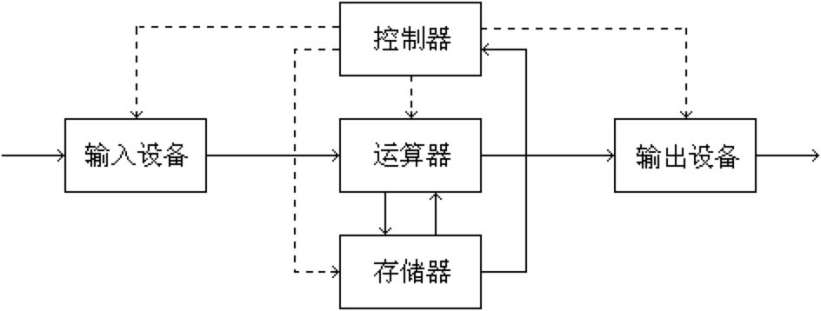
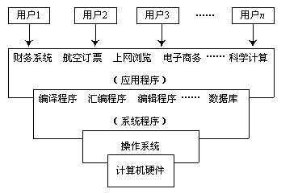

# 绪论

## 操作系统基本概念

### 模型

* 冯诺依曼模型
  

### 层级结构

### 概念

#### 用户观点

* 根据用户所使用计算机的不同设计不同的操作系统

#### 系统观点（资源管理）

* 操作系统是计算机系统的资源管理程序
* 资源类别
  * 硬件资源
  * 软件资源
* 按作用划分资源类型
  * 处理器（处理器管理）
  * 存储器（存储器管理）
  * 外设（设备管理）
  * 信息（程序，数据）（信息管理，即文件系统）‘

#### 进程观点

* 操作系统由若干个可以独立运行的程序（进程）和一个对这些程序进行协调的核心组成
* 进程分类
  * 用户进程
  * 系统进程

#### 虚拟机观点（机器扩充）

* 操作系统将裸机扩充为一个功能更强大，使用更方便的虚拟计算机
* 按照系统结构，可将操作系统划分若干层， 通过逐层功能扩充，完成最终的操作系统虚拟机

### 特征

#### 并发性

* 多个事件在同一时间间隔内发生
* 与并行性不同

#### 共享性

* 多个程序/用户共享硬件和软件资源
* 共享方式
  * 互斥共享：不可同时访问资源
  * 同时访问

#### 虚拟性

* 将一个物理实体变为若干个逻辑上存在的对应物
* 例
  * 多道程序设计（一个物理CPU虚拟成多台逻辑CPU）
  * 虚拟内存
  * 虚拟设备（独占设备变为共享设备）

#### 异步性

* 系统每道程序何时运行，执行顺序，所需时间都是未知的

**并发性**和**共享性**是操作系统最基本的特征

### 操作系统功能和服务

#### 处理器管理

* 进程控制（进程的创建，撤销及状态转换）
* 进程同步（对并发执行的进程进行协调）
* 进程通信
* 进程调度

#### 存储器管理

* 内存分配
* 内存保护
* 内存扩充

#### 设备管理

* 设备分配
* 设备传输控制
* 设备独立性（用户程序中设备与实际物理设备无关）

#### 文件管理

* 文件存储空间管理
* 目录管理
* 文件操作管理
* 文件保护

#### 用户接口

* 命令接口
  * 连接命令接口（交互式命令接口）：用于分时或实时系统（例：Linux shell）
  * 脱机命令接口（批处理命令接口）：用户在作业运行时不得干预
* 程序接口（系统调用）
* 图形接口（GUI）

## 操作系统的形成与发展

### 无操作系统阶段

* 使用人工操作计算机
* 步骤
  1. 程序纸带装入输入机
  2. 启动输入机送人程序和数据到计算机
  3. 使用控制台开关启动程序
  4. 程序运行完毕后，用户取走纸带和结果
* 缺点
  * 手工操作的慢速与CPU的高速的矛盾
  * 设备的低速与CPU高速的矛盾
  * 用户独占全机，资源利用率低
* 改进：脱机输入输出技术
  * 预先将程序和数据从低速设备载入高速输入带中
  * CPU需要程序和数据时，直接从输入待高速载入内存
  * 输出时同理

### 单道批处理系统

#### 特点

* 自动性
* 顺序性
* 单道性

### 多道批处理系统

#### 特点

* 多道
* 宏观上并行
* 微观上串行

### 操作系统的形成

* 为解决以下问题
  * 如何分配处理器
  * 如何分配内存
  * 如何分配设备
  * 如何保证程序和数据的安全性与一致性
  * 如何组织不同类型的作业
    * 计算型
    * I/O型
    * 重要而紧急作业
    * 要求系统及时响应的作业

## 操作系统的分类

### 批处理操作系统

* 单道批处理操作系统
* 多道批处理操作系统
  * 用户脱机使用计算机
  * 成批处理
  * 多道程序运行

### 分时操作系统

#### 实现方式

* 简单分时操作系统
* 具有“前台”和“后台”的操作系统
* 多道分时操作系统

### 特征

* 多路性
* 交互性
* 独占性
* 及时性

### 实时操作系统

* 对响应时间要求比分时操作系统更高
* 分类
  * 实时控制系统：控制生产	
  * 实时信息处理系统：如购票系统

### 通用操作系统

* 具有批处理操作系统，分时操作系统，实时操作系统至少二者的功能

### 嵌入式操作系统

* 运行于嵌入式主机

### 集群系统

* 将多个独立系统耦合起来，共同完成一个任务

### 网络操作系统

* 特点
  * 通过网络互联
  * 每个计算机有自己的操作系统
  * 通过通信设施实现互联
  * 通过通信设施完成信息交换，资源共享，互操作和协作处理

### 分布式操作系统

* 特点
  * 统一性：它是统一的操作系统
  * 共享性：所有资源共享
  * 透明性：看上去像一个计算机
  * 自治性：每个主机地位平等

## 操作系统运行环境

### CPU运行状态

* 核心态（管态，系统态）
* 用户态（目态）

### 特权指令

* 只能由操作系统在核心态使用的指令
* 例
  * I/Ozhil
  * 设置中断屏蔽字
  * 清内存指令
  * 存储保护指令
  * 设置时钟指令

### 内核指令主要内容

* 时钟管理
* 中断机制
* 原语
  * 处于操作系统最底层
  * 具有原子性
  * 运行时间短，调用频繁
* 系统控制的数据结构及处理

### 中断与异常

* 中断（外中断）：系统正常功能的一部分
* 异常（内中断）：由错误引起的
* 中断处理步骤
  1. 关中断
  2. 保存断点
  3. 引出中断服务程序
  4. 保存现场和屏蔽字
  5. 开中断（允许更高级中断）
  6. 执行中断服务程序
  7. 关中断
  8. 恢复现场和屏蔽字
  9. 开中断
* 1~3步为**中断隐指令**

### 系统调用

* 操作系统提供的子功能
* 类型
  * 设备管理
  * 文件管理
  * 进程控制
  * 进程通信
  * 内存管理
* 过程
  1. 程序执行系统调用
  2. 调用trap（陷入）指令进入内核态
  3. 系统在内核态执行相应功能
  4. 将结果返回并返回用户态

## 操作系统体系结构

### 模块组合结构

#### 优点

* 结构紧密
* 接口简单直接
* 效率高

#### 缺点

* 耦合度高
* 可扩展性差
* 可适应性差

#### 适合对象

* 系统小，模块少，使用环境比较稳定的系统

### 层次结构

#### 优点

* 组织和依赖清晰
* 有利修改和扩充

#### 缺点

* 层次划分不好做

### 微内核结构

#### 优点

* 可靠性好
* 灵活性高
* 便于维护

#### 缺点

* 效率低

#### 适合对象

* 分布式系统

## 其他零散知识

* 用户通过访管指令产生访管中断，进入内核态
* 分层操作系统层次
  1. 裸机
  2. CPU调度
  3. 内存管理
  4. 设备管理
  5. 文件管理
  6. 作业管理
  7. 命令管理
  8. 用户