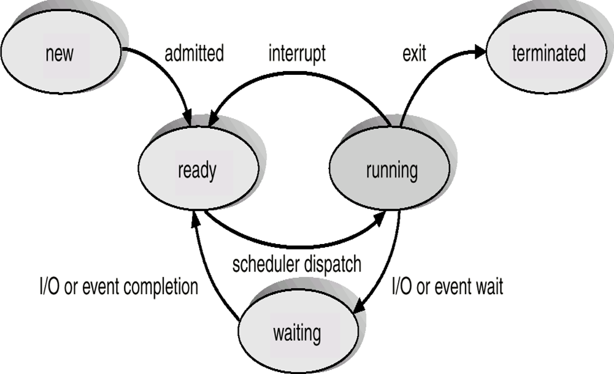

# 进程管理

## 进程概念

* 进程是资源分配的最小单位

* 独立运行的基本单位

* 与程序的区别

  | 进程                                     | 程序                             |
  | ---------------------------------------- | -------------------------------- |
  | 动态                                     | 静态                             |
  | 暂时                                     | 永久                             |
  | 组成不同，包括程序段，数据段和进程控制段 |                                  |
  | 通过调用关系，一个进程可执行多个程序     | 通过多次执行，程序可产生多个进程 |
  | 进程可创建其他进程                       | 程序不可创建其他程序             |
  | 具有并行特性                             | 没有并行特性                     |

* 与作业的区别

  * 作业是计算机完成某个任务所做工作的集合
  * 一个作业的完成经过如下过程
    1. 作业提交
    2. 作业收容
    3. 作业执行
    4. 作业完成
  * 进程是已提交作业的执行过程
  * 用户提交作业后，系统将它放入外存的等待队列
  * 进程只要被创建，总有部分内容留在内存
  * 一个作业至少由一个进程组成
  * 一个进程不能构成多个作业
  * 作业主要用于批处理系统，分时系统很少见（Unix无作业概念）
  * 进程存在于基本上所有的多道程序系统中

## 进程特征

* 动态性
* 并发性
* 独立性
* 异步性
* 结构性（使用PCB描述）
  * 程序段
  * 数据段
  * 进程控制块

## 进程状态

* new（创建态）
* waiting（阻塞态）
* running（运行态）
* ready（就绪态）
* terminated（结束态）
  

## 进程控制

### 进程的创建

* 举例
  * 终端用户登录系统
  * 作业调度
  * 系统提供服务
  * 用户程序的应用请求
* 过程
  1. 为新进程分配一个进程标识号，申请一个空白的PCB，PCB申请失败，则创建失败
  2. 为进程分配资源，分配内存（资源不足，进入阻塞态）
  3. 初始化PCB
  4. 若进程就绪序列能接纳新进程，则将新进程插入就绪队列，等待调度

### 进程的终止

* 引起终止的事件

  * 正常结束
  * 异常结束
    * 越界
    * 保护错
    * 非法指令
    * I/O故障
    * etc
  * 外界干预
    * 操作系统干预
    * 父进程请求
    * 父进程终止

* 过程（撤销原语）

  1. 根据标识符找到PCB，读出进程状态

  2. 若进程处于执行态，终止该进程执行，分配处理器资源给其他进程

  3. 若该进程还有子孙进程，终止其所有子孙进程

  4. 释放该进程全部资源，归还父进程或操作系统

  5. 从队列中删除PCB

### 进程的阻塞和唤醒

* 阻塞原语

  1. 找到标识号对应PCB

  2. 若该进程处在运行态，保护现场，将其状态转为阻塞态，终止运行
  3. 将PCB插入相应事件的等待队列，分配处理器资源给其他进程

* 唤醒原语

  1. 从该事件等待对列中找到相应PCB
  2. 从等待队列移除，设置为就绪态
  3. 插入就绪队列，等待调度

### 进程切换

* 过程

  1. 保存处理机上下文（程序计数器和其他寄存器）

  2. 更新PCB信息

  3. 将进程移入相应队列
  4. 选择另一个进程，更新其PCB
  5. 恢复内存管理的数据结构
  6. 恢复处理机上下文

## 进程结构

* 程序段
* 数据段
* 进程控制段（PCB）
  * 进程标识符（PID）
  * 进程当前状态
  * 进程队列指针
  * 程序和数据地址
  * 进程优先级
  * CPU现场保护区
  * 通信信息
  * 家族联系（父子进程标识等）
  * 占有资源清单

## 线程

### 引入目的

* 提高系统并发性

### 线程的定义

* 线程是进程的一个执行单元
* 线程是进程的一个可调度实体
* 线程是程序（或进程）中相对独立的一个控制流序列
* 线程本身不能单独运行
* 除**程序计数器**，**一组寄存器**，**栈**以外，线程不拥有自己的资源
* 线程与同一进程内其他线程共享全部资源

### 线程实现

* 内核级线程
  * 由操作系统完成创建和撤销工作
  * 内核线程堵塞时，不会影响其他线程
  * 处理器以线程作为时间片分配的基本对象
* 用户级线程
  * 进程利用线程库提供的创建，同步，调度和管理线程的函数来控制线程
  * 由应用进程完成用户级线程的维护
  * 调度再进程内部优化，通常采用非抢占式和更简单的规则，无需用户态/核心态切换，速度快
  * 一个线程堵塞时，整个进程堵塞
  * 处理器时间片以进程为基本对象
* 混合型线程
  * 内核支持多线程创建，撤销和调度
  * 系统同样运行用户应用程序可自行创建，调度和管理用户级的线程

### 多线程模型

* 基于混合型的线程实现

* 多对一
  * 多个用户级线程映射到一个内核级线程
  * 线程在用户空间管理，效率较高
  * 一个线程堵塞，整个进程堵塞
  * 无法利用多处理器并行运行
* 一对一
  * 一个线程堵塞不影响其他线程运行
  * 并发性高
  * 在多处理器计算机上实现多进程并行
  * 创建一个用户级线程时就要创建一个内核级线程，开销大
* 多对多模型
  * 内核级线程数<=用户级线程数
  * 打破前两种模型对用户进程的限制
  * 用户级线程可并行执行，数量也不受限
  * 一个用户级线程堵塞时，可执行其他线程

## 进程通信

### 共享存储器系统

* 在存储器中划分一个共享存储区
* 多个进程通过对共享存储区的存储进行通信
* 分类
  * 低级方式：基于数据结构的共享
  * 高级方式：基于存储区的共享
* 通信步骤
  1. 通信前，进程申请一个共享存储区，并指名关键字
  2. 系统返回该存储区的描述符
  3. 申请者将共享存储区附接到进程上，即可如访问普通存储器一样读写共享存储区

### 消息传递系统

* 系统提供一组通信原语实现通信，隐藏细节，简化了通信程序
* 分类
  * 直接通信方式（缺点：消息传递与进程名绑定，改动比较麻烦）：
    1. 发送进程将消息发送至接收进程
    2. 将其挂在接收进程的消息缓存队列
    3. 接收进程从消息缓冲队列获取信息
  * 间接通信方式（例：电子邮件系统）：
    1. 发送进程将消息发送至中间实体（信箱）
    2. 接收进程从信箱中取得信息

### 管道通信系统

* 管道是连接读写进程的**共享文件**
* 写进程以字符流形式将数据送入管道
* 读进程从管道中接收数据


## 处理器调度

### 三级调度

#### 高级调度/作业调度/宏观调度/长程调度

* 调度单位为**作业**
* 功能：从外存中调入一个或多个作业执行
* 一般几分钟一次
* 调度算法
  * 先来先服务（最简单）
  * 短作业优先（较常用）
  * etc

#### 中级调度/交换调度/中程调度

* 调度单位为**进程**
* 功能：
  * 将外存交换区的符合条件的挂起进程调入内存，改为就绪态
  * 将阻塞状态的进程交换到外存交换区
  * 主要涉及外存和内存间的调度

#### 低级调度/进程调度/微观调度/短程调度

* 调度单位为**进程**
* 功能： 从就绪队列选取一个进程，并分配处理器资源
* 运行频率高，几十毫秒一次

### 调度的基本原则

* CPU利用率
* 系统吞吐量：单位时间系统完成的作用数目
* 响应时间
* 周转时间
  * $作业i的周转时间T_i=作业i的完成时间-作业i的提交时间$
  * $n个作业的平均周转时间=\frac{\sum_{1}^{n}{T_i}}{n}$
  * $作业i的带权周转时间W_i=\frac{T_i}{作业i的运行时间}$
  * $n个作业的平均带权周转时间=\frac{\sum_{1}^{n}{W_i}}{n}$

### 进程调度

#### 进程调度的功能

* 记录系统所有进程的有关情况和状态特征
* 选择获得处理器的进程
* 处理器分配

#### 引起进程调度的原因

* 当前运行进程结束
* 当前运行进程堵塞
* 执行完系统调用等系统程序后返回用户进程（系统进程执行完毕）
* 抢占式调度中，更高优先级的进程要求使用处理器
* 分时系统中，进程的时间片用完

#### 不能执行进程调度的情况

* 中断处理过程中
* 操作系统内核临界区中
* 完全屏蔽中断的原子操作过程中

#### 进程调度方式

* 抢占方式/可剥夺方式
* 非抢占式方式/不可剥夺方式

### 常见调度算法

#### 先来先服务调度算法（FCFS）

* 用于**作业调度**，**进程调度**

#### 短作业优先调度算法（SJF）

* 用于**作业调度**，**进程调度**
* 所有作业同时到达时，SJF平均周转时间最短
* 长作业容易发生饥饿现象

#### 优先级调度算法

* 用于**作业调度**，**进程调度**
* 优先级确定方式
  * 按进程类型确定：系统进程高于用户进程
  * 按作业资源要求确定：申请资源越少，优先级越高
  * 按用户类型和要求确定
  * 动态优先级
    * 进程优先级随占有CPU时间上升而下降
    * 进程优先级随占有等待时间上升而上升
* 分类
  * 抢占式
  * 非抢占式
* 优先级相同时，一般使用FCFS算法

#### 时间片轮转调度算法

* 用于**进程调度**
* 时间片太大：退化为FCFS
* 时间片太小：进程切换开销过大
* 时间片确定因素
  * 系统响应时间：满足分时系统对响应时间的要求
  * 就绪队列的进程数目：进程数与时间片大小成反比
  * 系统处理能力：速度越快，时间片越小

#### 高响应比优先调度算法

* 用于**作业调度**
* $响应比=\frac{作业等待时间+估计运行时间}{估计运行时间}$
* 同时考虑了长短作业
* 计算响应比增加了开销

#### 多级队列调度算法

* 用于**进程调度**
* 将就绪队列划分成多个独立队列
* 每个独立队列采用一种调度算法

#### 多级反馈队列调度算法

* 用于**进程调度**
* 时间片轮转算法与优先级调度算法的综合和发展
* 设置多个就绪队列，各个就绪队列优先级逐级降低
* 优先级越高的队列时间片越短
* 新进程进入系统时，放入第一级队列
* 进程时间片执行完毕后，移入下一级队列的末尾
* 对于第i级队列来说，前i-1给队列均为空时，才会调度第i级队列内的进程
* 当处理器处理第i级队列的进程时，若新进程进入高优先级队列中，将该进程重新放入第i级队列末尾，执行新进程
* 优点
  * 终端型作业用户：短作业优先
  * 短批处理用户：周转时间较短
  * 长批处理用户：不会饥饿

## 进程同步

### 临界资源

#### 访问过程

1. 进入区：检查可否进入临界区的部分
2. 临界区
3. 退出区：清除访问临界区的部分
4. 剩余区

### 同步

* 直接制约关系
* 多个进程的执行需要依赖其他进程

### 互斥

* 间接制约关系
* 多个进程不能同时访问某个临界资源
* 同步准则（避免同时访问临界资源）
  * 空闲让进
  * 忙则等待
  * 有限等待：等待时间不能是无限的
  * 让权等待：等待时转让CPU资源

### 实现互斥的基本方法

#### 软件实现

##### 算法1：单标志法

```c++
void P0(){
    while(turn!=0);
    //访问临界资源
    turn=1;
    //剩余部分
}
void P1(){
    while(turn!=1);
    //访问临界资源
    turn=0;
    //剩余部分
}
```

* 缺陷：
  * 两进程只能交替访问临界区

##### 算法2：双标志法

```c++
void Pi(){
    while(flag[j]);
    flag[i]=true;
    //访问临界资源
    flag[i]=false;
    //剩余部分
}
void Pj(){
    while(flag[i]);
    flag[j]=true;
    //访问临界资源
    flag[j]=false;
    //剩余部分
}
```

* 优点
  * 可交替进入
* 缺陷
  * 可能同时进入临界区

##### 算法3 双标志法后检查

```c++
void Pi(){
    flag[i]=true;
    while(flag[j]);
    //访问临界资源
    flag[i]=false;
    //剩余部分
}
void Pj(){
    flag[j]=true;
    while(flag[i]);
    //访问临界资源
    flag[j]=false;
    //剩余部分
}
```

* 缺陷
  * 可能都无法进入临界区

##### 算法4 Peterson‘s Algorithm

```c++
void Pi(){
	turn=j;
    flag[i]=true;
    while(flag[j]&&turn==j);
    //访问临界资源
    flag[i]=false;
    //剩余部分
}
void Pj(){
	turn=i;
    flag[j]=true;
    while(flag[i]&&turn==i);
    //访问临界资源
    flag[j]=false;
    //剩余部分
}
```

#### 硬件实现

##### 中断屏蔽法

```c++
// 关中断
// 临界区
// 开中断
```

##### 硬件指令法

```c++
bool TestAndSet(bool * lock){
    bool old=*lock;
    *lock=true;
    return old;
}
// 临界区访问方式
// 共享变量lock
while(TestAndSet(&lock));
// 访问临界区
lock=false;
// 其他部分

void Swap(bool* a,bool *b){
    bool tmp=*a;
    *a=*b;
    *b=*a;
}
// 临界区访问方式
// 共享变量lock
bool key=true;
while(key!=false){
    Swap(&key,&lock);
}
// 访问临界区
lock=false;
// 其他部分

```

### 信号量

#### 整数型信号量

* 使用一个整数作为信号量
* wait时，始终忙等

#### 记录型信号量

* 使用一个整数和所有等待该资源的进程链表作为信号量
* wait时，让权给下一个进程

### 管程

#### 定义

* 使用共享数据结构表示共享资源，并对该共享数据结构实施操作的一组过程所组成的资源管理程序称为**管程**

#### 组成

* 管程的名称
* 管程内部的共享结构数据说明
* 对数据结构操作的一组过程
* 对共享数据初始化语句

#### 特点

* 将申请和释放资源的操作封装起来，只能通过管程访问共享资源
* 每次仅允许一个进程进入管程，多个进程同时调用某一方法时排队等待

#### 条件变量

* wait：阻塞某一进程
* signal：唤醒一个进程
* 条件变量只能实现进程的阻塞和唤醒功能，没有维护一个值

### 经典同步问题

* 生产者消费者
* 读者写者
  * 读优先
  * 写优先
  * 读写公平
* 哲学家就餐
* 吸烟者问题

## 死锁

### 必要条件

* 互斥条件
* 不剥夺条件
* 请求并保持：进程至少保持一个资源，在请求其他资源时不释放已保持的资源
* 循环等待

### 处理策略

* 死锁预防：破坏死锁产生的必要条件
* 死锁避免：分配资源时，防止资源进入不安全状态
* 死锁检测：不对资源分配限制，定期检测死锁是否发生，并解除死锁

### 策略对比

|          | 资源分配策略           | 实现方式                                                  | 优点                                         | 缺点                                       |
| -------- | ---------------------- | --------------------------------------------------------- | -------------------------------------------- | ------------------------------------------ |
| 死锁预防 | 保守<br />宁可资源闲置 | 1. 一次请求所有资源<br />2. 资源剥夺<br />3. 资源按序分配 | 适用于突发式处理的进程<br />不必进行剥夺     | 效率低<br />初始化时间长                   |
| 死锁避免 | 折中                   | 寻找各种可能的安全顺序                                    | 不必进行剥夺                                 | 必须知道将来的需求<br />进程不能长时间阻塞 |
| 死锁检测 | 宽松只要允许就分配资源 | 定期检测死锁是否发生                                      | 不延长初始化时间<br />允许对死锁进行现场处理 | 通过剥夺解决死锁，造成损失                 |

### 死锁预防

* 破坏互斥条件：不符合实际
* 破坏不剥夺条件：进程申请新资源失败时，必须释放已保持的资源
  * 缺点：实现复杂，开销大，降低吞吐量
* 破坏请求并保持条件：一次性分配所有资源
  * 缺点：资源严重浪费
* 破坏循环等待条件：按资源编号升序申请
  * 缺点：限制新设备增加，容易使资源浪费，对编程造成麻烦

### 死锁避免

* 使用安全性算法判断是否是安全状态
* 申请资源时，先预分配资源，然后检测是否安全
* 若仍处于安全状态，才分配资源
* Request矩阵代表最大请求资源数

### 死锁检测与解除

#### 死锁检测

* 使用类似于安全性算法的方式检测是否发生死锁
* 此时Request矩阵代表当前个进程申请的资源
* 死锁避免的安全性算法条件要强于死锁检测的算法

#### 死锁解除

* 剥夺资源：从其他进程中抢夺足够的资源
* 撤销进程：撤销一些进程从而释放资源
* 进程回退：使若干个进程还原至可避免死锁的地步

## 其他零散知识

* 只有死锁预防对资源申请顺序有要求