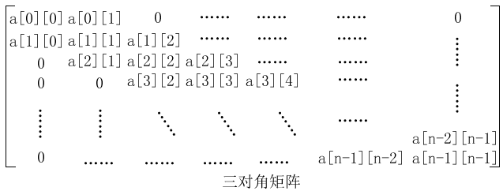
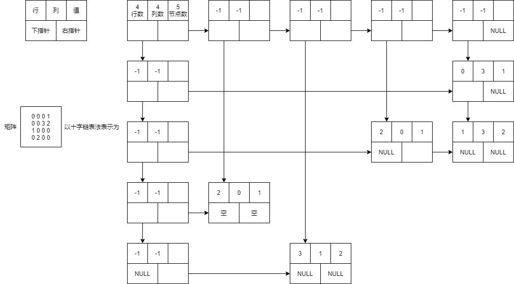

# 数组矩阵与广义表

## 矩阵压缩

* 对称矩阵

  * 只需存储上半部分或下半部分

* 上三角矩阵/下三角矩阵

  * 同对称矩阵

* 三对角矩阵

  * 形如

    

  * 自行寻找规律

## 稀疏矩阵存储

* 使用三元组存储

  ```c++
  struct Node{
  	int value;
      int row;
      int col;
  }
  ```

* 存储结构

  * 邻接表
  * 十字链表法
    * 

## 广义表

### 定义

* 表元素可以是原子或广义表的线性表结构
* 长度：最外层广义表的个数
* 深度：对广义表进行展开，最大层数即为深度
* 表头：广义表非空时，第一个元素即为表头
* 表尾：广义表内除表头外剩余元素组成的广义表即为表尾

### 广义表举例

* A=()
  * 空表
  * 长度=1
  * 深度=1
* B=(d,e)
  * 长度=2
  * 深度=1
* C=(b,(c,d))
  * 长度=2
  * 深度=2
* D=(B,C)
  * 元素全为广义表
  * 长度=2
  * 深度=3
* E=(a,E)
  * 长度=2
  * 深度=∞
* L=(a,(b,(c,(d)), e), f )
  * 长度=3
  * 深度=4
  * 表尾=((b,(c,(d)), e), f )

