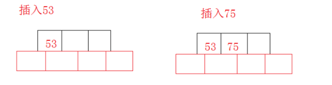
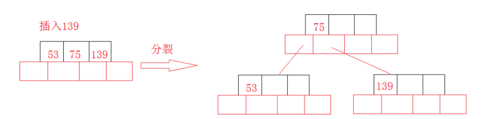
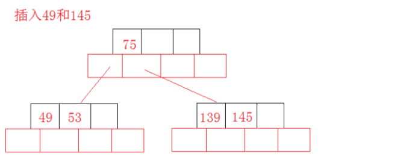
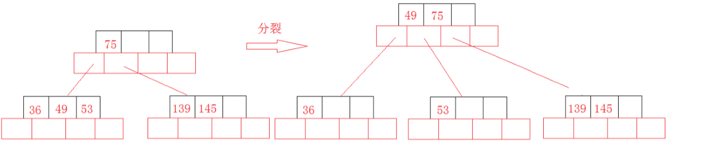

# 查找

## 概念

* 查找表：用于查找的数据结构
  * 静态查找表：建表后不进行修改的查找表
    * 顺序查找
    * 二分查找（折半查找）
    * 散列查找
  * 动态查找表：建表后需进行修改的查找表
    * 二叉排序树
      * 二叉平衡树
      * B树
      * B+树
    * 散列查找

* 查找长度：查找过程中比较关键字的次数

## 分块查找

* 将查找表分为若干子块
* 子块间有序（如：若子块A<子块B，则A中所有元素都小于B中任意元素）
* 块内数据无序
* 块间使用索引表查找
* 块内使用顺序查找

## B树

### 特性

* 每个节点最多m棵子树，至多含有m-1个关键字，即在关键字两端分叉
* B树每个节点都可以存放关键字（数据）
* 非叶根节点至少有两颗子树（即至少存在节点左右两端的两个终端节点代表查找失败）
* 除根节点外，所有非叶子节点至少含有$\lceil \frac m2 \rceil$个子树，即含有$\lceil \frac m2 \rceil -1$个关键字
* 叶节点（终端节点）不存放信息，代表查询失败
* 对于关键字树为n，高度为h（不包括终端节点所在的那一层），阶数为m的B树
  $ log_m(n+1) \leq h \leq log_{\lceil \frac m2 \rceil}(\frac {n+1}2)+1$

### 查找

* B树节点存储在磁盘，将节点加载置内存后，使用顺序查找或折半查找查找关键字

### 插入

* 当节点内关键字数目n=m时，从中间左右分叉，将中间节点添入父节点
  
  
  
  

### 删除

* 当删除关键字后，节点数=$\lceil \frac m2 \rceil-1$时
  * 如果兄弟结点关键字个数大于$\lceil \frac m2 \rceil-1$，则父结点中的关键字下移到该结点，兄弟结点中的一个关键字上移，删除操作结束。
  * 将父结点中的关键字下移与当前结点及它的兄弟结点中的关键字合并，形成一个新的结点。原父结点中的关键字的两个孩子指针就变成了一个孩子指针，指向这个新结点。
  * 然后当前结点的指针指向父结点，重复上述步骤

## B+树

### 特点

* 每个节点最多m棵子树，至多含有m个关键字，即仅在关键字一段分叉
* B+树非叶子节点
* 非叶根节点至少有两颗子树
* 除根节点外，所有非叶子节点至少含有$\lceil \frac m2 \rceil$个子树，即含有$\lceil \frac m2 \rceil $个关键字
* 叶节点包含所有关键字和指向记录的指针，同时所有叶节点用指针串联
* B+树中，非叶节点仅用于索引下一颗子树
* 可执行顺序查找或多路查找

## B树与B+树区别

|                       | B树                                        | B+树                                   |
| --------------------- | ------------------------------------------ | -------------------------------------- |
| n个关键字对应子树数目 | n+1                                        | n                                      |
| 节点内关键字数目范围  | $\lceil \frac m2 \rceil -1\leq n \leq m-1$ | $\lceil \frac m2 \rceil \leq n \leq m$ |
| 非叶节点内容          | 包含关键字和数据                           | 仅包含指向下一子树的索引               |

## 散列查找

### 散列函数

#### 直接定址法

* $H(key)=a*key+b$
* 优点
  * 简单，不会冲突
* 缺点
  * 关键字分布不连续的情况下会导致空间浪费
* 适用场景
  * 关键字分布连续

#### 除留余数法

* $H(key)=key \bmod p$
* p的选取：选择不大于散列表长但最接近的指数p
* 最简单
* 最常用

#### 数字分析法

* 通过分析数据，选取数码分布最均匀的若干位作为散列地址
* 适用场景
  * 已知的关键字集合
* 缺点
  * 若更换了关键字，需要重新构造散列函数

#### 平方取中法

* 对关键字进行平方后，选择中间的若干位
* 优点
  * 分布较均匀

### 冲突处理

#### 开放定址法

* 重新查找新的散列地址
* $H_i=(H(key)+d_i) \bmod m\ 其中m为散列表长$

##### 增量选择方式

* 线性探测法
  * $d_i=0,1,2,3...m-1$
  * 缺陷
    * 相邻散列地址容易堆积大量元素，造成查找效率降低
* 平方探测法
  * $d_i=0^2,1^2,-1^2,2^2,-2^2,3^2,-3^2...k^2,-k^2...$
  * 其中m需满足m为可表示成4k+3的素数
  * 缺点
    * 不能探测到散列表内所有单元，但至少能探测到一半
  * 优点
    * 能避免堆积
* 再散列法
  * $d_i=i*H_2(key)$
  * 优点
    * 最多探测m-1次就能探测所有散列表位置
* 伪随机序列法
  * $d_i=伪随机序列$

#### 拉链法

* 使用链表存储所有冲突的关键字

### 查找效率

#### 决定因素

* 散列函数
* 处理冲突
* 装填因子$\alpha=\frac {表中记录数n}{散列表长度m}$
  * 装填因子越大，代表越容易发生冲突

