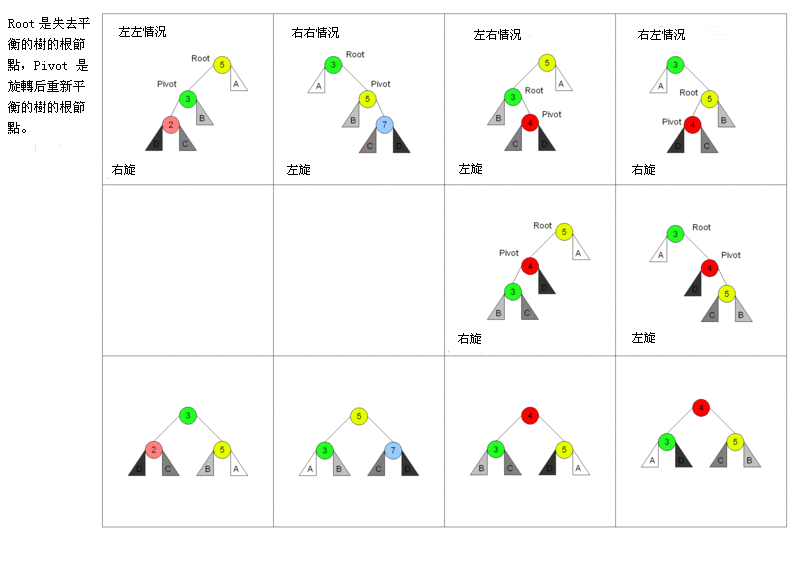

# 树

## 基本概念

* 节点的度：一个节点的孩子个数称为节点的**度**
* 树的度：树中最大节点的度
* 深度：从根节点开始自顶向下计算
* 高度：从叶节点开始自底向上计算

## 树的性质

* 树的节点树=所有节点的度+1

* 度为m的树第i层至多有m^i-1^个节点

* 高度为h的m叉树最多有(m^h^-1)/(m-1)个节点（通过等比数列求和得到）

* 具有n个节点的m叉树最小高度为$\lceil log_m(n(m-1)+1) \rceil$
  推导过程：
  $$
  高度最小的情况下，每个节点的度数都尽可能多\\
  因此高度为h的m叉树在此情况下的节点数n满足以下条件\\
  \frac{(m^{h-1}-1)}{(m-1)} < n \leq \frac{(m^{h}-1)}{(m-1)}\\
  =>\ log_m(n(m-1)+1)\leq h < log_m(n(m-1)+1)+1\\
  =>\ h=\lceil log_m(n(m-1)+1) \rceil
  $$
  

## 二叉树

### 二叉树性质

* 非空二叉树叶子节点的数目等于度为2的节点数+1
  推导过程：
  $$
  设度为0的节点数为n_0, 度为1的节点数为n_1,度为2的节点数为n_2,总结点数为n\\
  n=n_0+n_1+n_2\\
  n=n_1+n_2*2+1\\
  =>\ n_0=n_2+1
  $$

* 非空二叉树第k层至多有2^k-1^个节点

* 高度为h的二叉树最多有2^h^-1个节点

* 结点数为n的完全二叉树高度$h=\lceil log_2(n+1) \rceil或\lfloor log_2(n) \rfloor+1$

### 特殊二叉树

#### 满二叉树

* 高度为h，且具有2^h^-1个结点的二叉树称为满二叉树

#### 完全二叉树

* 高度为h的二叉树，最多仅有第h层未满，且第h层节点从左往右排（等价于满二叉树第h层右侧抽取掉部分节点），该树称为完全二叉树

#### 二叉排序树

* 左子树节点小于根节点，右子树节点大于根节点

#### 平衡二叉树

* 任一节点的左子树与右子树的深度之差的绝对值不超过1

## 线索二叉树

### 构造说明

* 对于某一结点，若无左子树，则该节点左指针指向其直接前驱节点
* 对于某一结点，若无右子树，则该节点右指针指向其直接后继节点
* 使用标记位tag标记左右指针为左右子树还是前驱后继节点

## 森林

### 森林与树的转换

* 将兄弟节点转换成右子树
* 子节点转换为左子树
* 森林中的所有树看作是兄弟

### 森林的遍历

#### 先序遍历

* 等价于先序遍历森林转换后的二叉树

#### 后序遍历/中序遍历

* 等价于中序遍历森林转换后的二叉树

## 二叉排序树

### 平衡二叉树

#### 旋转

* RR旋转（左单旋转）
  * 条件：右子树的右子树插入了新节点导致失衡
* LL旋转（右单旋转）
  * 条件：左子树的左子树插入了新节点导致失衡
* LR旋转（先左后右旋转）
  * 条件：左节点的右子树插入新节点导致失衡
* RL旋转（先右后左旋转）
  * 条件：右节点的左子树插入了新节点导致失衡

## 哈夫曼树

### 概念

* 又称最优二叉树

### 构造

* 找到权值最小的两个子树拼接成新的子树
* 重复上述步骤

### 哈夫曼树的带权路径长度（WPL）

* 某一叶子节点的WPL=该点权值*该点到根节点的路径长

