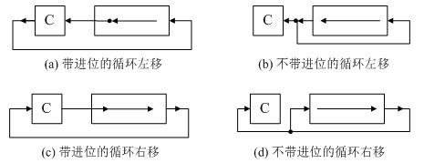
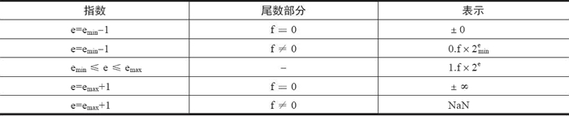

# 数据的表示与运算

## 进制转换

### 前提

* 待转换数为10进制
* 转换的数为k进制

### 整数部分

* 对整数部分除以k并进行取余，之后将余数逆序输出
* 例：$19_{(10)}转为二进制$
  * 19/2=9······1
  * 9/2=4········1
  * 4/2=2········0
  * 2/2=1········0
  * 1/2=0········1
  * 故结果为10011

### 小数部分

* 乘以k后，取整数部分，并正序输出
* 例$0.6875_{(10)}转2进制$
  * 0.6875*2=1.375······取1
  * 0.375*2=0.75··········取0
  * 0.75*2=1.5··············取1
  * 0.5*2=1···················取1
  * 故结果为0.1011

## 编码

### 真值和机器数

* 真值：机器数代表的实际值
* 机器数：在计算机中用于表示真值的编码数

### BCD码

* 使用4位二进制数表示0-9十个数字
* 存在6钟冗余状态
* 常见BCD码
  * 8421码（最常见）
    * 有权码
    * 设数字为$a_3a_2a_1a_0$
    * 则表示十进制数$D=8*a_3+4*a_2+2*a_1+a_0$
    * 相加时若结果大于10，需要加6并进位进行修正结果
  * 余三码
    * 8421码的基础上加上$(0011)_{(2)}$得到
    * 例：8的余三码为1011，0的余三码为0011
  * 2421码
    * 有权码
    * 大于等于5的数首位为1
    * 小于5的数首位为0
    * 例：5的2421码为1011

### ASCII码

### 汉字编码

* 组成
  * 输入编码
    * 区位码：两个字节表示一个汉字，每个字节使用7位二进制编码，构成一个94*94的二维代码表
    * 国标码=$(区位码)_{(16)}+2020H$
  * 汉字内码=$(国标码)_{(16)}+8080H$
  * 汉字字形码

### 校验码

#### 奇偶校验码

* 检错编码

* 奇校验：添加校验位后1的个数为奇数
* 偶校验：添加校验位后1的个数为偶数

#### CRC（循环冗余校验码）

* 默认只有检错功能
* 又称(N,K)码，N为编码长度，K为校验位长度
* 具有r检测位的多项式可以检测出所有长度小于等于r的突发错误
* 长度大于r的突发错误逃逸概率为$\frac1{2^r}$
* 构造过程（例）
  * 设生成多项式G(x)=x^3^+x+1
  * 设数据多项式M(x)=x^3^+1
  * 即G(x)代表1011
  * M(x)代表1001
  * 将待发送数据左移G(x)的最高位次，得到1001 000
  * 使用1001000对1011进行模2除法，得到余数110
  * 故CRC码为1001 110

#### 海明码

* 纠错编码
* 设数据位数为k，校验码位数r满足 $2^r-1>=k+r$
* 海明码生成步骤，步骤中海明码，数据，校验码的位号皆从1开始

  1. $
     将校验码P_i放置在海明码的第2^i位
     $

  2. $
     将数据位P_i依次放入海明码剩余位处
     $

  3. $
     将海明码各各个位号分为r组，使第i组各位号j满足\ j\&i!=0
     $

  4. $
     对每一组采用偶校验的方式得到每一组中校验码P_i的值
     $

* 海明码校验步骤

  1. $
     将第i组内所有数据进行异或操作，得到S_i
     $

  2. $
     将S_i依次拼接在一起，得到二进制数码S，若S==0，则海明码无措，反之，则第S位出错
     $

* 海明码若要检测出d位错误，则海明距需要d+1位，即当d>1时，通过上述公式得到校验码后，还需要令r+=d-1

* 海明码若要纠正d位错误，则海明距需要为2d+1

## 定点数的表示与运算

### 定点数的表示

* 无符号数
* 有符号数

### 机器数的定点表示

* 定点小数
* 定点整数

### 数码表示

* 原码
* 补码
* 反码
* 移码
  * 0的表示唯一
  * 对于偏移值为2^n^（n为机器字长-1）的移码，补码与移码仅相差个符号位
  * 移码保持了数据原有的大小

### 定点数的运算

#### 移位运算

##### 算数移位运算

* 原码
  * 左移右移都补0
* 反码
  * 正数：左移右移都补0
  * 负数：左移右移都补1
* 补码
  * 左移时都补0
  * 右移时保持符号位不变

##### 逻辑移位运算

* 所有码制下左移右移皆补0

##### 循环移位运算



#### 原码定点数的加减法

##### 加法

1. 先判断符号位，若相同，绝对值相加，若不同，则绝对值相减（大减小）
2. 最终符号与绝对值大的数相同

##### 减法

1. 减数取反在进行加法操作

#### 补码定点数的加减法

##### 加法

* 直接相加，舍去进位

##### 减法

* 减数取反在进行加法操作

#### 溢出判定

* 一位符号位

  * 操作数符号相同时，结果与操作数符号不同时，则溢出

* 双符号位

  | 符号位$S_1S_2$ | 结果             |
  | -------------- | ---------------- |
  | 00             | 结果为正，无溢出 |
  | 01             | 结果为正溢出     |
  | 10             | 结果为负溢出     |
  | 11             | 结果为负，无溢出 |

* 一位符号位加数据位进位

  * 若进位$C_s=最高数位C_1$，则没有溢出，反之，溢出

#### 定点数的乘法

##### 原码一位乘

* 采用双符号位
* 符号位单独求
* 使用右移操作模拟竖式计算的进位
* 结果使用乘数所在寄存器存放低位结果，新寄存器存放高位结果
* **详细见参考书**

##### 原码二位乘

* 使用乘数的两位来计算部分积

* 即

  | $y_n$（高位） | $y_{n+1}$（低位） | 操作                         |
  | ------------- | ----------------- | ---------------------------- |
  | 0             | 0                 | 部分积右移两位               |
  | 0             | 1                 | 部分积加上被乘数后右移两位   |
  | 1             | 0                 | 部分积加上被乘数*2后右移两位 |
  | 1             | 1                 | 部分积加上被乘数*3后右移两位 |

  

##### 补码一位乘

###### 校正法

* 符号位不参与计算
* 为避免溢出，采用双符号位

* 当乘数为负数时，计算结果应加上$[-X]_补$，进行校正，其中X为被乘数

###### 比较法（booth算法）

* 在乘数末位增补一位附加位$y_{n+1}$，令初值为0

* 移位按补码右移规则进行

* 根据$y_ny_{n+1}$的值执行相应操作
  其中X为被乘数

  | $y_n$（高位） | $y_{n+1}$（低位） | 操作                        |
  | ------------- | ----------------- | --------------------------- |
  | 0             | 0                 | 部分积右移一位              |
  | 0             | 1                 | 部分积加$[X]_补$，右移一位  |
  | 1             | 0                 | 部分积加$[-X]_补$，右移一位 |
  | 1             | 1                 | 部分积右移一位              |

* **详细见参考书**

##### 补码二位乘

* 部分积和被乘数采用3符号位，乘数使用双符号位

#### 定点数的除法

* 讨论前提：绝对值<1的定点小数

##### 原码恢复余数法

* 符号位单独处理

* 步骤

  ```c++
  if(abs(被除数)-abs(除数)>=0){
      throw exception(溢出);
  }else{
      商=0;
      被除数=abs(被除数);
      除数=abs(除数);
      负除数=-除数;			//使用补码
      n=位数长度;
      // 循环执行n+1次
      while(n--){
          被除数+=负除数;		//计算机只有加法器
      	if(被除数<0){
              被除数+=除数;
          }else{
              商++;
          }
          if(n!=0){
              被除数<<=1;
              商<<=1;
          }
      }
      
      余数=被除数;
      为商和余数附上符号位
  }
  ```

##### 原码的不恢复余数法（加减交替法）

* 符号位单独处理

* 步骤

  ```c++
  if(abs(被除数)-abs(除数)>=0){
      throw exception(溢出);
  }else{
      商=0;
      被除数=abs(被除数);
      除数=abs(除数);
      负除数=-除数;			//使用补码
      n=位数长度;
      
      被除数+=负除数;
      // 循环执行n+1次
      while(n--){
      	if(被除数<0){
              if(n!=0){
                  被除数<<=1;
                  商<<=1;
              }
              被除数+=除数;
              
          }else{
              商+=1;
              if(n!=0){
                  被除数<<=1;
              	商<<=1;
              	被除数+=负除数;
          	}
              
          }
          
      }
      
      余数=被除数;
      为商和余数附上符号位
  }
  ```

##### 补码的不恢复余数法（交替加减法）

* 步骤

  ```c++
  if(abs(被除数)-abs(除数)>=0){
      throw exception(溢出);
  }else{
      商=0;
      负除数=-除数;			//使用补码
      n=位数长度;
      // 循环执行n次
      while(--n){
      	if(被除数与除数异号){
              被除数<<=1;
              被除数+=除数;
          }else{
              商+=1;
              被除数<<=1;
              被除数+=负除数;
          }
          商<<=1;
      }
      商+=1;
      余数=被除数;
      为商和余数附上符号位
  }
  ```

  

## 浮点数的表示与运算

### 浮点数的一般形式

* 阶符+阶码数值部分+数符+尾数的数值部分

### 规格化浮点数

* 使尾数M满足关系$\frac1r<=|M|<=1$，其中r位尾数进制
* 原码规格化（二进制下）
  * 正数：0.1xxxxx的形式
    * 最大正数为0.11...1
    * 最小正数为0.10...0
    * 取值$\frac12<=M<=1-2^{-r}$
  * 负数：1.1xxxxx的形式
    * 最大负数为1.10...0
    * 最小负数为1.11...1
    * 取值$-(1-2^{-r})<=M<=-(\frac12)$
* 补码规格化（二进制下）
  * 正数：0.1xxxxx的形式
    * 最大正数为0.11...1
    * 最小正数为0.10...0
    * 取值$\frac12<=M<=1-2^{-r}$
  * 负数：1.0xxxxx的形式
    * 最大负数为1.01...1
    * 最小正数为1.00...0
    * 取值$-1<=M<=-(\frac12+2^{-r})$

### IEEE 754标准

#### 格式

* 数符+阶码（使用移码表示，可代表正负）+尾数数值位（使用规格化原码表示）

* **被忽略的首位1代表整数1**

  | 类型                          | 数符 | 阶码(移码2^k^-1) | 尾数数值 | 总位数 | 偏移值 |
  | ----------------------------- | ---- | ---------------- | -------- | ------ | ------ |
  | 短浮点数（尾数首位1忽略）     | 1    | 8                | 23       | 32     | 0x7F   |
  | 长浮点数（尾数首位不忽略）    | 1    | 11               | 52       | 64     | 0x3FF  |
  | 临时浮点数（尾数首位1不忽略） | 1    | 15               | 64       | 80     | 0x3FFF |

#### 表示范围

| 格式   | 最小值                         | 最大值                                      |
| ------ | ------------------------------ | ------------------------------------------- |
| 单精度 | 1*2^-126^(阶码为1，尾数为0)    | 2^127^*(2-2^-23^)（阶码为254，尾数为全1）   |
| 双精度 | 1*2^-1022^（阶码为1，尾数为0） | 2^1023^*(2-2^-52^)（阶码为2046，尾数为全1） |

#### 特殊数值

* IEEE 标准指定了以下特殊值：±0、反向规格化的数、±∞ 和 NaN（如下表所示）。这些特殊值都是使用 e~max+1~ 或 e~min-1~ 的指数进行编码的。
  

#### 浮点数的加减

1. 对阶，阶数小的向阶数大的靠齐（即阶码小的进行右移操作）
2. 尾数求和
3. 规格化
   * 左归：尾数左移
   * 右归：尾数右移
4. 舍入
   * 0舍1进法：右归时，若尾数为1，则尾数末位加1，若为0则舍入
   * 恒置1法：尾数最后一位始终置1
5. 溢出判断：根据阶码判断是否溢出

## 算数逻辑单元

### 全加器

#### 输入

* C~i-1~：低位传来的进位
* A~i~：加数A
* B~i~：加数B

#### 输出

* X~i~：该位结果，$X_i=A_i\bigoplus B_i \bigoplus C_{i-1}$
* C~i~：该位进位，$C_i=A_iB_i+(A_i \bigoplus B_i)C_{i-1}$

### 半加器

* 没有低位进位的加法器
* 两个半加器可组成全加器

### 串行加法器

* 只设置一个全加器的加法器，每一次计算产生一位和
* 操作数长k位，则一次计算要进行k次串行操作，效率差

### 并行加法器

#### 串行进位链

* 每完成一次计算，将进位作为下一个全加器的输入
* 虽然解决了部分延迟问题，但仍难以提高运算速度

#### 并行进位链

* 主要思路：将n位全加器分为若干组，组内并行计算，组间串行计算
* 并行计算实现：
  * 根据公式得$C_i=G_i+P_i\bigoplus C_{i-1} \\其中G_i=A_iB_i,P_i=A_i \bigoplus B_i$
  * 将其展开，将$C_i$仅用输入来表示，从而避免需要等待全加器计算出进位​
* 单重分组跳跃进位链
  * 直接将n位全加器分为若干组
* 双重分组跳跃进位链
  * 将n位全加器分成若干大组
  * 每个大组又包括多个小组
  * 小组计算出的结果作为大组的输入
  * 大组组间串行，组内并行

### 算数逻辑单元的功能和结构

* 功能
  * 算术运算
  * 逻辑运算
* 结构
  * 两个输入变量
  * 一个控制变量
  * 一个输出函数

## 数据的存储与排列

### 大小端存储

#### 大端存储

* 高字节位于高地址位

#### 小端存储

* 高字节位于低地址位

### 边界对齐存储

* 提高指令和数据的存取速度
* 浪费内存空间

* 一般按最大基本类型的字节数对齐