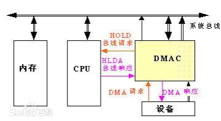

# 输入输出系统

## 发展历程

### 早期阶段

* 通过CPU才能完成主存与I/O系统的信息交换
  
* 缺点
  * 交换信息时，CPU需要停止运算，效率低
  * I/O设备逻辑电路与CPU控制器构成不可分的整体，难以增加和删除设备
* 改进
  * 交换信息时最好不通过CPU
  * 设备逻辑电路应与CPU无关，这里可采用总线完成

### 接口模块和DMA阶段（中断方式和DMA方式）

* I/O设备通过接口与主机相连，并使用总线连接CPU与接口
  * 每个接口模块包括**数据通路**和**控制通路**
  * 数据通路起到缓冲的作用
  * 控制通路发出各种控制命令以及中断处理的需求
  * 使用总线结构可以随时增减设备
  * 优点
    * 小部分解决第一个问题
    * 解决了第二个问题
  * 缺点
    * 中断处理需要花费CPU时间，只能小部分解决第一个问题

* 使用DMA技术进一步提高并行性，通过DMA接口可直接进行数据传输，只需要在传输结束后发送中断请求
  * 缺点
    * 增加了硬件成本，使控制变得十分复杂；
    * 对众多的DMA进行管理，会占用CPU的工作时间，直接影响CPU的整体工作效率。

### 具有通道结构的阶段

* 使用通道处理机来管理主存和I/O设备间的通信
* 适用于大、中型计算机系统
* 通道负责管理IO设备以及实现主存与IO设备之间交换信息，能够独立的执行通道指令所编写的输入输出程序
* 通道受CPU的IO指令启动、停止或改变其工作状态
* CPU不直接参与管理IO设备，故CPU的资源利用率更高

### 具有I/O处理器的阶段

- IO处理机独立于主机工作，既可完成IO通道对IO的控制，又可以完成码制变换、格式处理、数据块检错、纠错等操作
- 与CPU工作的并行性更高

## I/O系统基本概念

### I/O软件

#### 类别

* 驱动程序
* 用户程序
* 管理程序
* 升级补丁
* etc

#### 实现

* I/O指令
  * 格式：操作码（判断是否为I/O操作）+命令码（判断执行哪种I/O操作）+设备码
* 通道指令
  * 包含内容
    * 数据首地址
    * 数据字节数或数据尾地址
    * 操作类型
    * 操作设备编号

### I/O硬件

#### 类别

* 外部设备
* 设备控制器
* 接口
* I/O总线

## 外部设备

### 输入设备

#### 键盘

##### 输入步骤

1. 按下一个键
2. 识别扫描码
3. 将扫描码翻译成ASCII码

#### 鼠标

#### 工作原理

* 在平面上移动时，传感器将运动方向和距离检测出来，转换成光标的移动

### 输出设备

#### 显示器

##### 参数

* 屏幕大小（使用对角线长度表示）
* 分辨率（表示的像素点个数）
* 灰度级（像素点亮暗程度或颜色种类，典型有8位，16位）
* 刷新
* 刷新频率
* 显示存储器/显存/VRAM（存储图像数据）
  * VRAM容量=分辨率*灰度位数
  * VRAM带宽=分辨率*灰度位数\*帧频

##### 分类

* 按显示内容划分

  * 字符显示器
    * 以m*n的点阵作为显示字符的基本单位
    * 扫描过程中根据点阵信息控制扫描电子束的开与关
  * 图形显示器
    * 将图像的坐标点和绘图指令组成显示文件存放在缓冲存储器
    * 将显示文件传送给矢量（线段）产生器产生模拟电压控制电子束的移动
    * 需要不断刷新
    * 优点
      * 分辨率高，曲线平滑
    * 缺点
      * 显示复杂图形会有闪烁感

* 按显示器件划分

  * 阴极射线管（CRT）显示器

    * 扫描方式
      * 光栅扫描：每次扫描整个屏幕
        * 逐行扫描
        * 隔行扫描（先扫描奇数行，再扫描偶数行）
      * 随机扫描
        * 只扫描要作图的地方
        * 画图速度快，成像清晰
        * 驱动复杂，价格贵
    * 优点
      * 可视角度大
      * 无坏点
      * 色彩还原度高，色度均匀
      * 多分辨率模式
      * 响应时间短

  * 液晶显示器（LCD）

    * 原理
    * 利用液晶电光效应，由图像信号电压直接控制薄膜晶体管，再间接控制液晶分子的光学特性来实现图像的显示
    * 优点
      * 体积小
      * 重量轻
      * 省电
      * 无辐射
      * 绿色环保
      * 画面柔和
      * 不伤眼
    
  * LED（发光二级管）显示器
    
    * 原理
      * 控制半导体发光二级管来显示文字，图像
    * 优点
      * 亮度高
      * 功耗小
      * 可视角度大
      * 刷新速率快
  
#### 打印机

##### 分类

* 按工作原理
  * 击打式打印机
    * 原理：使用机械动作让印子机构、色带与纸撞击打印字符
    * 优点
      * 成本低
      * 印刷质量好
    * 缺点
      * 噪声大
      * 速度慢
    * 种类
      * 活字打印机
      * 点阵针式打印机
  * 非击打式打印机
    * 原理：使用电、磁、光、喷墨等物理化学方法打印字符
    * 优点
      * 印刷质量更好
      * 速度快
      * 噪声小
    * 缺点
      * 价格贵
* 按工作方式
  * 点阵打印机
  * 针式打印机
    * 原理：使用针头撞击纸张进行打印
    * 优点
      * 原理简单
      * 耗材便宜
    * 缺点
      * 打印分辨率低
      * 打印速度慢
    * 使用场景
      * 打印票据
  * 喷墨式打印机
    * 原理：喷雾墨点经过电极偏转在纸上形成字符，彩色喷墨打印机使用三原色墨滴按比例形成各种颜色
    * 优点
      * 噪声小
      * 速度快
      * 质量好
    * 缺点
      * 防水性差
      * 高质量打印需要专门打印纸
  * 激光打印机
    * 原理：使用激光束扫描，在感光鼓（核心部件）形成潜像，最好经过显影、转印和定影形成字符和图像
    * 优点
      * 打印质量高
      * 速度快
      * 噪声小
      * 处理能力强
    * 缺点
      * 耗材多
      * 价格贵
      * 不能复写打印多份
      * 对纸张要求高
* 按数据传输方式
  * 串行打印机（逐字打印）
  * 行式打印机（逐行打印）

### 外存储器

* 见**存储器**章节

## I/O接口

### 功能

* 实现主机和外设的通信连络控制
* 进行地址译码和设备选择
* 实现数据缓冲
* 信号格式转换
* 传送控制命令和状态信息
* 传输数据

### 基本结构

* 数据线（双向）
* 设备选择线（单向，CPU->接口）
* 命令线（单向，CPU->接口）
* 状态线（单向，接口->CPU）
* 内部接口：与系统总线相连，并行传输
* 外部接口：与外设相连，可能串行传输，故接口需具有串/并转换功能

### 接口类型

* 按数据传送方式划分
  * 串行接口
  * 并行接口
* 按主机访问方式划分
  * 程序查询接口
  * 中断接口
  * DMA接口
* 按功能选择的灵活性划分
  * 可编程接口
  * 不可编程接口

### I/O端口

#### 定义

* 接口电路中可直接被CPU访问的寄存器

#### 分类

* 数据接口（可读写）
* 状态接口（只读）
* 控制接口（只写）

#### 编址

* 统一编址（存储器映射方式）
  * 将I/O端口当作存储器单元一同编址
  * 优点
    * 不需要专门的输入输指令
    * 使端口用有较大的编址空间
  * 缺点
    * 占有存储器容量
    * 执行速度慢
* 独立编址（I/O映射方式）
  * I/O端口地址空间与主存地址相互独立
  * 优点
    * 输入输出需要专门指令，使程序结构清晰
    * 不影响主存容量
  * 缺点
    * 输入/输出指令较少
    * 增加了控制的复杂性

## I/O方式

### 程序查询方式（程序控制I/O方式）

#### 步骤

1. CPU初始化程序，设置传送参数
2. 向I/O端口发出命令字，启动I/O设备
3. CPU从外设接口读取状态信息
4. CPU不断查询外设状态，直至外设准备就绪
5. 传送数据
6. 修改地址和计数器参数
7. 判断传送是否结束，若未结束，继续第3步

#### 特点

* 数据成块传送，故需要计数器记录传送字数
* 需给出传送数据的首地址

#### 就绪状态

* 输入：输入缓冲满
* 输出：输出缓冲空

### 程序中断方式

#### 中断概念

##### 中断功能

* 实现CPU与I/O设备并行工作
* 处理硬件和软件错误
* 实现人机交互，用户干预机器需要中断
* 实现多道程序，分时操作，多道程序的切换需要中断
* 实时处理系统需要中断系统实现快速响应
* 实现目态与管态的切换，称为软中断
* 多处理器系统的信息交流和任务切换

##### 分类

* 按中断源划分
  * 内中断：处理器和内存内部产生的中断（如运算错误，特权指令等）
  * 外中断：处理器和内存以外设备产生的中断（如时钟中断，I/O中断等）
* 按软硬件划分
  * 硬件中断：由硬件产生的中断
  * 软件中断：由某条特定指令产生的中断
* 按屏蔽与否划分
  * 非屏蔽中断：不受中断标志位影响，关中断的条件下也会相应
  * 可屏蔽中断：受中断标志位影响
  * 非屏蔽中断和可屏蔽中断均属于外中断和硬件中断

#### 流程

1. 中断请求
2. 中断判优：判断中断优先级
   * 一般的优先级划分
     * 硬件中断>软件中断
     * 非屏蔽中断>可屏蔽中断
     * DMA请求>I/O设备传送的中断请求
     * 高速设备的中断>低速设备的中断
     * 输入设备的中断>输出设备的中断
     * 实时设备的中断>普通设备的中断
3. 中断响应
   * 响应条件
     * 中断源有中断请求
     * CPU允许中断并开中断
     * 一条指令执行完毕并且没有更紧急的任务
4. 中断隐指令
   1. 关中断
   2. 保存断点
   3. 引出中断服务程序
5. 中断向量表
   * 中断服务程序入口地址表
   * CPU响应中断后，中断硬件会自动将中断向量地址（中断向量的入口地址）送入CPU，由CPU完成程序中断
6. 中断处理过程
   1. 中断隐指令（硬件完成）
      1. 关中断
      2. 保存断点
      3. 引出中断服务程序
   2. 中断服务程序
      1. 保存现场和屏蔽字
      2. 开中断（实现中断嵌套）
      3. 执行中断服务程序
      4. 关中断
      5. 恢复现场和屏蔽字
      6. 开中断
      7. 中断返回

#### 多重中断

##### 条件

* 中断服务程序中开中断
* 优先级高的中断源有权中断优先级低的中断源

#### 中断处理硬件

* 中断请求触发器
* 中断屏蔽字触发器
* 排队器
* 中断向量地址形成部件

### DMA（直接存储器存取）方式

#### 适用外设

* 磁带机
* 磁盘机

#### 特点

* 主存既可以被CPU访问，也可以被外设访问
* 数据块传送时，主存地址的确定，传送数据的计数由硬件部件直接实现
* 主存需要开辟专用缓冲区
* CPU与外设并行工作
* DMA开始传送前需要通过程序预处理，结束后需要通过中断进行后处理

#### DMA控制器功能

* 接收外设发出的DMA请求，并向CPU发出总线请求
* CPU响应总线请求，发出总线响应信号，接管总线控制权，进入DMA操作周期
* 确定传送数据的主存单元地址和传送方向，发出读写控制信号，执行数据传送操作
* 向CPU报告DMA操作的结束

#### DMA控制器组成

* 主存地址计数器
* 传送长度计数器
* 数据缓冲寄存器
* DMA请求触发器
* “控制/状态”逻辑
* 中断机构

#### DMA传送方式

* 停止CPU访问主存
  * DMA访问主存时，CPU放弃地址线，数据线及有关控制线的使用权，此时CPU处在不工作状态
* DMA与CPU交替访存
  * 当CPU周期大于存取周期时，将CPU周期划分成两部分，一部分由DMA执行访存操作，另一部分由CPU进行访存操作
* 周期挪用（周期窃取）
  * CPU不访存时，DMA直接进行访存
  * CPU正在访存时，DMA等待CPU访存结束再访存
  * CPU和DMA同时发出访存指令时，DMA让CPU暂时放弃总线几个存取周期，之后再交由CPU访存

#### DMA传送过程

1. 数据预处理
   * 由CPU完成
   * 步骤
     1. CPU执行几条I/O指令测试设备
     2. CPU设置DMA控制器有关寄存器初值、传送方向、启动设备等
     3. CPU继续执行
     4. 设备准备就绪后向DMA控制器发出DMA请求，之后DMA控制器向CPU发出总线请求（统称DMA请求）
2. 数据传送
   * 传输基本单位可以是字节、字或数据块
   * 硬盘使用数据块传输
   * DMA控制器使用循环实现数据块传输
   * 该阶段完全由DMA硬件控制
3. 后处理
   * 步骤
     1. DMA控制器向CPU发出中断请求
     2. CPU执行中断程序进行结束处理
        * 校验数据是否正确
        * 测试传输过程是否出错
        * 是否继续使用DMA传输数据

### DMA与程序中断的区别

1. 中断方式时程序的切换，需要保护和恢复现场，DMA除了预处理和后处理，其他情况不占用CPU资源
2. 对中断请求的响应只能发生在每个指令执行完毕后，对DMA请求的响应可以发生在任意机器周期结束后（只要CPU不占用总线即可）
3. 中断方式传输过程需要CPU干预，DMA不需要，因此传输速度快
4. DMA请求优先级高于中断请求
5. 中断方式具有对异常事件的处理能力，DMA仅用于传输数据块的I/O操作
6. 中断方式使用程序传输，DMA方式使用硬件传输

  

​    

