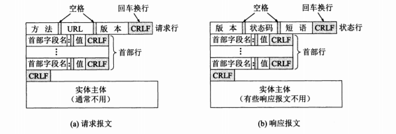

# 应用层

## 应用模型

### 客户/服务器模型（C/S）

#### 工作流程

1. 服务器等待请求
2. 客户机发出请求，等待接收结果
3. 服务器收到请求后进行处理，并返回客户机

#### 常见C/S模型应用

* Web
* FTP
* 远程登录
* 电子邮件

#### 特点

* 地位不平等
* 客户机间互相不直接通信
* 可扩展性不佳

### P2P模型

#### 特点

* 网络中任意一对计算机（对等方）都可直接通信
* 减轻了服务器的依赖
* 可扩展性好
* 网络健壮性强

#### 缺点

* 占用较多内存
* 损害硬盘
* 使网络拥塞

## DNS

### 组成

* 层次域名空间
* 域名服务器
* 解析器

### 层次域名空间

* 域名不区分大小写
* 除**连字符（-）**外不允许使用其他标点
* 每个标号不允许超过63字符，整个域名最长不能超过255字符
* 域名级别从左到右递增
* 顶级域名分类
  * 国际顶级域名（nTLD），如cn，us
  * 通用顶级域名（gTLD），如com，net
  * 基础结构域名：只有一个arpa，用于反向解析域名

### 域名服务器

#### 根域名服务器

* 13个冗余集群服务器
* 管理顶级域

#### 顶级域名服务器

* 管理该顶级域名下的所有二级域名

#### 授权域名服务器

- 将其管辖的主机域名转换为IP地址

#### 本地域名服务器

* 用于接收主机发出的DNS解析请求
* 在网络配置中填写的域名服务器地址

### 域名解析过程

#### 递归查询

1. 主机查询本地DNS
2. 本地DNS查询跟DNS
3. 根DNS再查询下一个DNS
4. 以此类推，得到结果后递归返回

#### 迭代查询

1. 主机查询本地DNS
2. 本地DNS查询根DNS
3. 根DNS告诉本地DNS下一个查询的DNS
4. 本地DNS继续查询，以此类推
5. 得到结果后返回主机

### 缓存

* 当一个DNS得到某个域名解析结果后，可对其进行缓存，优化查询时间

## FTP

### 功能

* 提供不同种类主机间的文件传输能力
* 以用户权限管理的方式提供用户对远程FTP服务器上的文件管理能力
* 以匿名FTP的方式提供公用文件共享能力

### 工作步骤

1. 打开熟知端口（21）等待连接
2. 用户发送请求后，启动从属进程处理用户请求，处理结束后从属进程关闭
3. 回到等待状态

**注**：

* FTP在整个会话期间保持用户信息，以跟踪用户当前目录等

####  控制连接

* 使用21端口
* 用于传输控制信息（使用7为ASCII码）

#### 数据连接

* 用于传输数据
* 一般使用20端口
* 修改文件时，先将文件副本传送到本地主机，再将修改后的文件副本传回服务器

#### 主动模式与被动模式

* 主动模式：服务器使用20端口主动连接客户机传送数据
* 被动模式：客户机连接服务器的随机端口进行数据传输

## 电子邮件

### 构件

* 用户代理：用户与邮件系统的接口
* 邮件服务器
* 邮件协议
  * SMTP（简单邮件传输协议）：发送邮件
  * POP3（邮局协议版本3）：拉取邮件
  * IMAP（交互邮件访问协议）：拉取邮件

### 发送和接收过程

1. 发信人使用**用户代理**编写邮件，**用户代理**使用**SMTP**将邮件发送至发送端邮件服务器
2. 发送端邮件服务器将邮件放入缓存区中，等待发送
3. 发送端邮件服务器的SMTP客户进程发现有待发送邮件，向接收端邮件服务器的SMTP服务器建立TCP连接，传输邮件
4. 接收端邮件STMP服务器收到邮件后，将其放入用户邮箱中
5. 收件人调用**用户代理**，**用户代理**使用**POP（或IMAP）**将邮件从邮件服务器的用户信箱取回

### 邮件格式

* 信封
* 内容
  * 首部：由RFC 822规定
  * 主体：用户自行编写

### 多用途网际邮件扩充（MIME）

* 定义了传送非ASCII编码的邮件
* 内容
  * 新首部字段
    * MIME版本
    * 内容描述
    * 内容标识
    * 内容传送编码
    * 内容类型
  * 定义了新的内容格式（包括多媒体邮件）
  * 定义了传送编码
* 传送编码
  * quoted-printable编码
    * ASCII编码不败你
    * 对于非ASCII编码，每两B前增加一个'='字符
    * 对于等号，也再其前面增加一个'='字符
  * base64
    * 将二进制代码划分为若干24位长度的单元
    * 每六位一组，从0~63分别用大写字母，小写字符，数字，‘+’，‘/’表示
    * 最后使用==表示最后一组只有8位，用=表示最后一组只有16位

### STMP

* 步骤
  1. 建立连接，发送主机的STMP客户端和接收主机的SMTP服务器，不需要中间主机
  2. 邮件传输
  3. 释放连接
* 缺点：
  * 任何客户端都可向邮件服务器发送邮件，造成垃圾邮件泛滥

### POP3

* 工作方式（按拉起邮件之后邮件服务器是否删除邮件来区分）
  * 下载并保留
  * 下载并删除
* 密码：明文存储

### WEB邮件系统

* 客户代理与邮件服务器使用HTTP通信
* 邮件服务器之间使用SMTP

## WWW（万维网）

### 组成

* 统一资源定位符（URL）
* 超文本传输协议（HTTP）
* 超文本标记语言（HTML）

### HTTP

* 无状态
* 连接方式
  * 非持久连接：每个网页连接都需要建立一个TCP连接
  * 持久连接（HTTP/1.1支持）：服务器响应请求后保持连接
    * 非流水线：客户机收到前一个响应后才能发送下一个请求
    * 流水线（默认）：客户机可连续发送对引用对象的请求

* 步骤
  1. 浏览器分析URL
  2. 浏览器向DNS申请解析域名
  3. DNS解析域名并返回
  4. 浏览器与服务器建立TCP连接
  5. 浏览器发出HTTP请求
  6. 浏览器相应请求
  7. TCP连接断开
  8. 浏览器解释html文件，并将界面显示给用户

* 报文结构

  * 分类

    * 请求报文
    * 响应报文

  * 结构

    * 开始行：区分报文类型
    * 首部行：说明浏览器，服务器以及报文主题的一些信息
    * 实体主体

    

