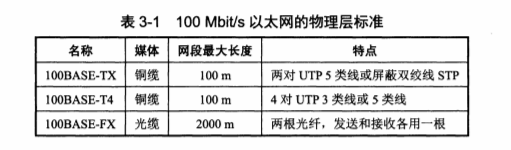
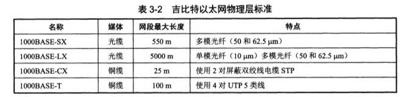
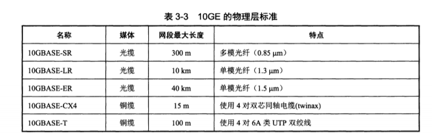
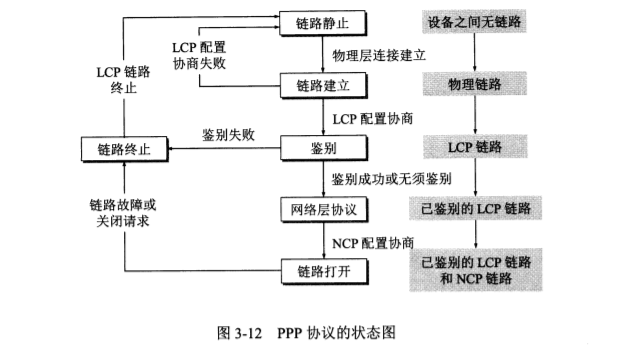

# 数据链路层

## 信道类型

* 点对点信道
* 广播信道

## 功能

* 链路管理（用于面向连接的服务）
* 帧同步
* 差错控制
* 透明传输
* 流量控制（存在于OSI模型，现一般在传输层实现）

## 提供的服务种类

* 无确认的无连接服务
* 有确认的无连接服务
* 有确认的有连接服务

## 三个基本问题

### 封装成帧

* 字符计数法

  * 在一个帧头部增加一个计数字段表示该帧的字节数
  * 缺点：一旦传输出现问题，将导致帧同步失败
  * 很少使用

* 首尾界符法

  * 使用控制字符**SOH**和**EOT**代表帧开始和结尾
  * 缺点：仅能传输文本文件
  * 改进：字节填充的首位界符法

* 字节填充的首尾界符法

  * 在发送特殊字符前填充一个转义字符将其转化为转义字符

  * 如：特殊字符在数据中按如下规则转化

    | 原字符 | 转义字符 |
    | ------ | -------- |
    | SOH    | ESC SOH  |
    | EOT    | ESC EOT  |
    | ESC    | ESC ESC  |

* 比特填充的首尾标记法

  * 在帧首尾使用比特串**01111110**作为标记
  * 在数据中，每出现连续5个1即在后面增加一个0，避免出现连续6个1

* 物理编码违例法

  * 使用非法的物理编码区分帧开始和结束
  * 如：在曼彻斯特编码中，使用**高-高电平**和**低-低电平**代表帧开始和结尾

### 差错控制

* 仅保证收到并交付给上一层的帧是无差错的概率非常接近于1，对于有差错的帧直接丢弃

#### 检错编码

##### 奇偶校验码

* 奇校验：添加校验码后使1的数目为奇数
* 偶校验：添加校验码后使1的数目为偶数
* 只能检测奇数错误的情况

##### CRC

* 具有r检测位的多项式能检测出所有长度小于等于r的突发错误

* 长度大于r的突发错误逃逸的概率是
  $$
  \frac{1}{2^r}
  $$

#### 纠错编码

##### 海明码

* 设数据位数为k，校验码位数r满足 $2^r-1>=k+r$

* 海明码生成步骤，步骤中海明码，数据，校验码的位号皆从1开始

  1. $
     将校验码P_i放置在海明码的第2^i位
     $

  2. $
     将数据位P_i依次放入海明码剩余位处
     $

  3. $
     将海明码各各个位号分为r组，使第i组各位号j满足\ j\&i!=0
     $

  4. $
     对每一组采用偶校验的方式得到每一组中校验码P_i的值
     $

* 海明码校验步骤

  1. $
     将第i组内所有数据进行异或操作，得到S_i
     $

  2. $
     将S_i依次拼接在一起，得到二进制数码S，若S==0，则海明码无措，反之，则第S位出错
     $

* 海明码若要检测出d位错误，则海明距需要d+1位，即当d>1时，通过上述公式得到校验码后，还需要令r+=d-1

* 海明码若要纠正d位错误，则海明距需要为2d+1

## 流量控制

* 该部分在现代网络系统中属于传输层功能

### 停止-等待流量控制

* 发送方每发送一帧，则等待接收方发送**应答信号**，收到**应答信号**再发送下一帧
* 接收方每接受一帧，则向发送方发送一个**应答信号**
* 若发送方一直为收到**应答信号**，则发送方一直等待

### 滑动窗口流量控制

* 发送方和接收方使用一个长度为n的二进制序号来标识各个帧

* 发送方维护一个发送窗口，维持了一组可发送的帧的编号

* 接收方维护一个接收窗口，维持了一组可接收的帧的编号

* 发送窗口尾部每收到一个帧确认，即向前滑动一位

* 接收窗口尾部每收到一帧，即向前滑动一位

* $设发送窗口大小为W_T，接收窗口大小为W_R，则W_T+W_R<=2^n

## 可靠性传输

### 传输差错类型

* 比特差错
* 帧丢失
* 帧失序
* 帧重复

### 滑动窗口机制

* 使用**确认**和**超时重传**实现可靠传输，该策略称为**自动请求重发（ARQ）**

#### 确认帧传输方式

* 捎带确认（确认帧放在发送的数据中）
* 累计确认（发送编号为k的确认帧代表前k-1帧全部收到，等待第k帧）

#### 停止-等待协议

* 发送窗口尺寸=1
* 接收窗口尺寸=1
* 确认帧需要编号

#### 后退N帧协议（GBN）

* 1<=发送窗口尺寸<=2^n^-1​
* 接收窗口尺寸=1
* 某个帧出错了，发送方重发该帧之后的所有帧

#### 选择重传协议（SR）

* 为使效率最高，发送窗口尺寸==接收窗口尺寸
* 由$W_T+W_R<=2^n得\ W_T<=2^{n-1}$
* 接收方仅要求发送方重发出错的帧
* 不适用累计确认

## 缓存

* 带发送的帧全部放置在发送缓存中，发送窗口属于发送缓存的一部分
* 已接收等待交付的帧全部放置在接收缓存，接收窗口属于接收缓存的一部分

## 介质访问控制

### 信道划分介质访问控制

* 使用各个复用技术，见物理层

### 随机访问介质访问控制技术

#### 动态媒体接入控制

* 随机接入
* 受控接入

#### 随机接入

* ALOHA协议

  * 步骤
    1. 发送数据时不进行检测
    2. 没收到确认时认为发生冲突
    3. 等待一段随机时间后重新发送
  * 缺点
    * 信道利用率低
  * 改进
    * 使用时分ALOHA协议

* CSMA（载波侦听多址接入）

  * 步骤

    1. 发送信息前侦听信道是否空闲
    2. 若信道空闲则发送数据，若信道忙，则等待
    3. 若数据传输时发生冲突，则等待一段时间

  * 分类

    根据侦听到信道忙时的等待时间策略可分为以下几类

    | 信道状态 | 1-坚持CSMA   | 非坚持CSMA                 | p-坚持CSMA                       |
    | -------- | ------------ | -------------------------- | -------------------------------- |
    | 空闲     | 立刻发送数据 | 立刻发送数据               | 以p概率发送数据，（1-p）概率等待 |
    | 忙       | 继续侦听     | 等待一个随机时间后继续侦听 | 继续侦听                         |

* CSMA/CD（带冲突检测的载波侦听多址接入）

  * 使用环境：总线型网络或半双工网络，有线局域网
  * 步骤概括：先听后发，边听边发，冲突停发，随机重发
  * 具体步骤
    1. 发送数据前，侦听信道，若空闲则发送数据，若忙，则等待至空闲
    2. 传输过程中若检测到冲突存在，停止发送数据，并发出一个48bit的阻塞信号
    3. 在中止数据传输后，采用二进制指数退避算法等待一段随机时间

* CSMA/CA（带冲突避免的载波侦听多址接入）

  * 使用环境：无线局域网
  * 原因
    * 接收信号强度远小于发送信号强度，冲突检测花费过大
    * 存在部分站点无法侦听到对方的数据，即存在“隐蔽站”
  * 步骤
    1. 主机A发送数据前侦听信道，信道空闲时向目标主机B发送一个传输请求
    2. 若有多台主机同时向B发送传输请求，B检测到冲突后不回复，其余主机等待回复超时后采用二进制指数退避算法等待一段随机时间
    3. 若B只收到一个传输请求，则向A发送一个ACK
    4. A收到ACK后向B发送数据，A周边主机和B周边主机分别接收到A的传输请求和B的ACK，即可知道一个传输即将开始

* 争用期

  * 令以太网端到端往返时间2t为**争用期**
  * 对于任何主机来说，在其发送数据后至多经过2t时间就能发现是否发生冲突
  * 经过争用期还未检测到冲突时，即可保证本次传输无冲突
  * 以太网规定以太网争用期长度为**51.2μs**

* 最小帧长

  * 为保证发送站在发送完数据前能检测到冲突，因此需要定义一个最小帧长
  * $最小帧长=总线传播时延*数据传输速率*2$，即在数据发送完成可收到其他主机发送的数据，从而检测到冲突
  * 对于10Mb/s的以太网，最小帧长为64B，对于长度小于最小帧长的帧，以太网填充相应字节至64B

* 二进制退避算法

  * 设置基本退避时间，一般取争用期2t
  * 确定参数k，k=min(重传次数,10)
  * 在[0,2^k^-1]中随机选择一个数r
  * $则此次退让时间=2t*r$
  * 若重传次数超过16次，向上一层报告错误

#### 受控接入

* 令牌传递协议
  * 各节点按顺序交换令牌，只有持有令牌的的主机才能传输信息

## 局域网

### 标准

* IEEE 802.3 约等于以太网标准

### 特点

* 由一个单位所有
* 地理范围和站点数目有限
* 高数据率，低时延，低误码率
* 各站点平等
* 能进行广播和组播

### 特殊局域网

* 以太网
  * 逻辑拓扑：总线型
  * 物理拓扑：星形或扩展星形
* 令牌网
  * 逻辑拓扑：环形
  * 物理拓扑：星形
* FDDI（光纤分布数字接口）
  * 逻辑拓扑：环形
  * 物理拓扑：双环形

### 主要拓扑结构

* 星形
* 环形
* 总线型
* 树形（星形与总线型结合）

### 主要传输介质

* 双绞线（主流）
* 同轴电缆
* 光纤

### 模型

* 局域网模型对应物理层和数据链路层
* 数据链路层分为两个子层
  * 逻辑链路控制子层（LLC）：基本无用
  * 媒体接入控制子层（MAC）

### 以太网

#### 通信特点

* 无连接
* 不对数据帧编号，不要求确认（不可靠服务）

#### 帧格式

* MAC地址
  * 共48bit
  * 高24bit代表厂家
  * 低24bit由厂家分配
  * 单站地址：前8位最后一位为0
  * 组播地址：前8位最后一位为1，其余7位不全为1
  * 广播地址：前8位全为1

* 帧组成
  * 前导码：8B，不属于帧，用于时钟同步，可分为前同步码（7B）和帧开始定界符（1B）
  * 目的地址：6B
  * 源地址：6B
  * 类型：2B 上层使用的协议，IP：0x0800
  * 数据：46~1500B，数据最短长度=最短帧长-18B（首部尾部总长度）
  * 填充位：补全至最短帧长
  * 校验码：4B，采用CRC

#### 传输介质

| 参数       | 10Base5              | 10Base2              | 10Base-T     | 10Base-FL       |
| ---------- | -------------------- | -------------------- | ------------ | --------------- |
| 传输媒体   | 基带同轴电缆（粗缆） | 基带同轴电缆（细缆） | 非屏蔽双绞线 | 光纤对（850nm） |
| 编码       | 曼彻斯特编码         | 曼彻斯特编码         | 曼彻斯特编码 | 曼彻斯特编码    |
| 拓扑结构   | 总线形               | 总线形               | 星形         | 点对点          |
| 最大短长   | 500m                 | 185m                 | 100m         | 2000m           |
| 最多节点数 | 100                  | 50                   | 2/1024       | 2/1025          |

### 高速以太网

* 100Base-T以太网

  * 全双工下无冲突
  * 半双工使用CSMA/CD
    

* 吉比特以太网

  * 在1Gb/s下半双工或全双工工作

  * 全双工下无冲突

  * 半双工使用CSMA/CD

  * 载波延伸

  * 与10Base-T，100Base-T兼容

    

* 10吉比特以太网

  * 保留了IEEE 802.3规定的以太网帧格式

  * 只使用光纤传输

  * 只工作在全双工模式

  * 不适用CSMA/CD

    

### 无线局域网

#### 协议

* IEEE 802.11
  * IEEE 802.11a
  * IEEE 802.11b
  * etc.

#### 分类

* 由固定基础设施的无线局域网
  * 最小构件：基本服务集（BSS）
    * 组成：一个基站+若干移动站
  * BSS内所有站点可直接通信
  * 与BSS外站点通信需要通过基站
  * 基站也称为接入点（AP）
  * BSS可以是孤立的，也可通过接入点连接到一个主干分配系统（DS），再接入到另一个BSS，构成扩展服务集（ESS）
  * ESS可通过门桥（Portal）为无线用户提供一个到非IEEE 802.11无线局域网（如以太网）的接入
  * **基站**和**门桥**的作用与**网桥**类似
* 无固定基础设施无线局域网自组织网络
  * 由平等的移动站组成的临时网络
  * 各节点地位平等，中间节点皆为转发节点，具有路由功能
  * 自组织网络可以使用自己特定的路由选择协议，可以不与因特网相连

#### 帧地址字段格式

地址字段在数据帧中的用法：

| 功能                  | To DS | From DS | Address1（接收端） | Address2（发送端） | Address3 | Address4 |
| --------------------- | ----- | ------- | ------------------ | ------------------ | -------- | -------- |
| IBSS                  | 0     | 0       | DA                 | SA                 | BSSID    | 未使用   |
| To AP（基础结构型）   | 1     | 0       | BSSID              | SA                 | DA       | 未使用   |
| From AP（基础结构型） | 0     | 1       | DA                 | BSSID              | SA       | 未使用   |
| WDS（无线分布式系统） | 1     | 1       | RA                 | TA                 | DA       | SA       |

缩略语：

IBSS（Independent Basic Service Set）独立基本服务集

BSSID（Basic Service Set Identifier）基本服务集标识符

DA（Destination Address）目的地址

SA（Sender Address）源地址

RA（Receiver Address）接收端地址

TA（Transmission Address）发送端地址

WDS（Wireless Distribution System）无线分布式系统

#### 物理层

* 跳频扩频（FHSS）
* 直接序列扩频（DSS）

* 红外线（IR）

#### MAC层

* 由下至上分为两个子层
  * 分布协调功能子层（DCF）
  * 点协调功能子层（PCF）

* 协议：CSMA/CA

### 令牌环网

#### 环接口干线耦合器（TCU）

* 令牌环网每一个站点通过电缆与TCU与其他站点相连
* 作用：提供发送和接收数据接口
* 状态：收听状态和发送状态
* 数据传输方向：延特定方向从一个TCU到下一个TCU逐比特传输，每个TCU重新产生并重新传输每一比特

#### 逻辑拓扑

* 环形拓扑

#### 物理拓扑

* 星形拓扑

#### 传输过程

1. 网络空闲时，只有令牌帧循环传递
2. 令牌传递到要发信息的站点时，该站点修改令牌的一个标志位，并附加要传输的数据，然后继续传递
3. 数据帧延环路传递，收到帧的站点查看该帧的目的地址，若目的地址与自己的地址相同，则则接收该帧的副本
4. 数据帧继续延环路传输直至源站点，源站点收到后不再继续转发，也可对返回的数据帧进行校验，检测是否出错，若出错，则重传数据帧
5. 源站点传送完数据后，重新产生一个新令牌，传递给下一站点，交出对媒体的访问权限

## 广域网

### OSI模型层次

* 物理层
* 数据链路层
* 网络层

### 协议

#### PPP协议

* 组成：
  * 将IP数据报封装到链路的方法
  * 链路控制协议（LCP），用于建立，配置，测试，释放数据链路连接
  * 网络控制协议（NCP），用于支持不同的网络层协议
* 转义字符
  * 使用**0x7d**进行转义
  * **0x7e**->**0x7d 0x5e**
  * 当字符C<0x20时，C转义为**0x7d C+0x20**
* 帧格式
  * 标志字段（A），首尾各1B，规定为0x7e
  * 控制字段（C），规定为0x03
  * 协议字段 2B
    * 0x0021：IP数据报
    * 0xC021：PPP链路控制数据
    * 0x8021：网络控制数据
  * 信息部分
    * 大小：0~1500B
    * 点对点模型，不使用CSMA/CD
  * 帧校验序列（FCS），2B，使用CRC
* 连续传输PPP帧时，末尾的标志字段可作为下一帧的起始标志字段

* 工作过程
  
* 总结
  * 面向字节
  * 不需要的功能
    * 纠错（只进行检错）
    * 流量控制（由TCP负责）
    * 序号（不可靠传输，不需要序号）
    * 多点线路（PPP是点对点）
    * 半双工或单工（PPP只支持全双工）

#### HDLC协议

* 配置：
  * 非平衡配置：由一个主站控制整个链路
  * 平衡配置：链路两端都是复合站，可以平等的发起数据传输
* 站
  * 主站：控制链路操作，发出**命令帧**
  * 从站：按主站命令操作，发出**响应帧**
  * 复合站：主从站功能的结合
* 数据操作方式
  * 正常响应方式
    * 非平衡
    * 主站向从站传输数据，从站得到许可后，响应传输
  * 异步平衡方式：
    * 平衡
    * 任何复合站都可对另一站进行传输
  * 异步响应方式
    * 非平衡
    * 从站响应时不需要主站允许
* 透明传输
  * 非标志字段，每连续出现5位1，添加一个0

* 帧格式
  * 标志字段 1B，01111110
  * 地址：1B 全1为广播，全0无效
  * 控制字段：1B，将PPP帧类型划分为**信息帧**，**监督帧**，**无编号帧**
  * 信息字段：长度任意
  * 帧校验序列（FCS），2B，CRC
* 总结
  * 面向bit
  * 几乎总以硬件形式实现
  * 使用了编号和确认机制

## 设备

### 网桥

* 优点：
  * 过滤通信量
  * 扩大物理范围
  * 提高了可靠性
  * 可互联不同物理层，不同MAC子层和不同速率的以太网
* 缺点：
  * 增加了转发时延
  * 在MAC子层没有流量控制
  * 不同MAC子层桥接时时延更大
  * 只适用于用户数少的网络，否则会产生广播风暴
* 分类
  * 透明网桥
    * 不用配置转发表
    * 自学习：收到一帧后即增加或更新一个条目（源地址，进入的端口，时间）
    * 目的地址未知时，通过其他所有端口转发（除进入网桥的端口）
    * 使用生成树算法避免环路
    * 非最佳路由
  * 源选径网桥
    * 路由选择由源站负责
    * 路由发现算法
      1. 源站以广播方式向目的站发送一个发送帧
      2. 发送帧延所有可能的路由传输
      3. 到达目的站后原路返回
      4. 源站根据返回的路由信息选择最佳路由

### 交换机

* 本质：多端口网桥
* 工作方式：一般是全双工
* 交换机带宽
  * 半双工：$端口数*每个端口带宽$
  * 全双工：$端口数*每个端口带宽*2$
* 交换方式
  * 直通式交换：只检查目的地址
    * 优点：速度快
    * 缺点：安全性低，不支持不同速率端口的交换
    * **注**：此时转发时延只有读取目的地址6B的时间，考虑前导码时则是14B
  * 存储转发式交换：先将帧存储在高速缓存中，检查数据无误后再进行转发，数据有误直接丢弃
    * 优点：可靠性高，支持不同速率端口交换
    * 缺点：延迟高
* 转发表构造
  * 于网桥一样，将源地址写入或更新转发表
* VLAN
  * 在逻辑上建立局域网

## 广播域，冲突域

| 设备   | 隔离冲突域 | 隔离广播域 |
| ------ | ---------- | ---------- |
| 集线器 | 否         | 否         |
| 中继器 | 否         | 否         |
| 交换机 | 是         | 否         |
| 网桥   | 是         | 否         |
| 路由器 | 是         | 是         |

## 其他零散知识

* 计算两节点间最大距离时，应保证最短帧长无法在一个争用期发送完成