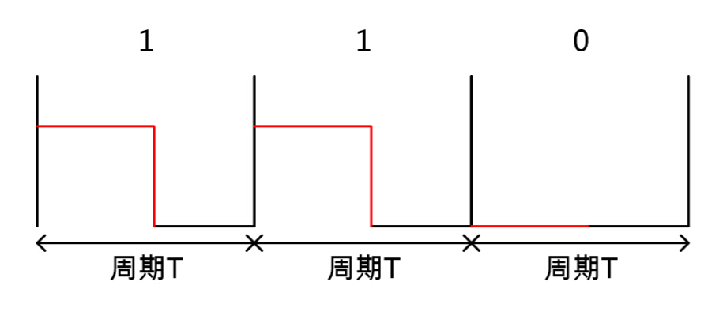
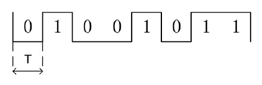
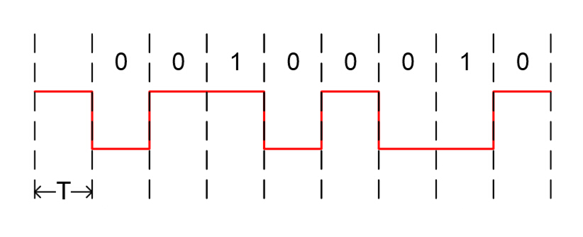
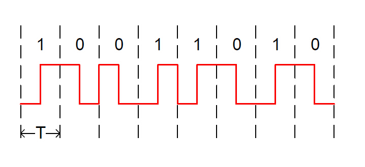
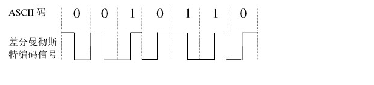
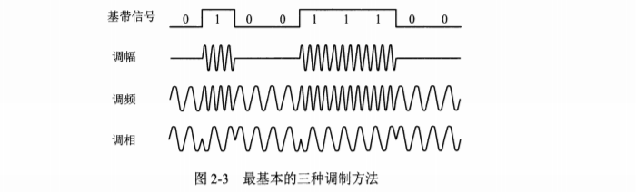

# 物理层

## 通信基础

### 信号

* 基带信号：传输**数字信号**
* 宽带信号：传输**模拟信号**

### 信源

* 产生和发送数据的源头

### 信宿

* 接受和处理数据的终点

### 信道

* 信号的传输媒介（逻辑部件）

### 传输方式

* 串行传输：一个比特一个比特传输
  * 用于距离长，速度慢的传输
* 并行传输：多信道同时发送多个比特
  * 用于距离短，速度快的传输

### 通信方式

* 同步通信：接收端和发送端的时钟频率相等，先发送同步字符令双方同步后，就可以连续发送大块数据（硬件开销大）
  * 以帧为单位
* 异步通信：发送数据可以间隔任意长时间（需要增加额外的信息定界，硬件开销低）
  * 以字节为单位

### 通信模式

* 单工通信
* 半双工通信
* 全双工通信

### 波特率

* 单位时间传输的码元个数
* 单位：Baud

### 比特率（信息传输速率）

- 单位时间传输的二进制码元数
- 单位：bit

$$
波特率=波特率*log_{2}(N)\\ N为一个码元所能表示的状态数
$$

### 带宽

* 通信线路允许通过的频率范围

## 物理层特性

* 机械特性：接口大小形状等
* 电气特性：电压范围
* 功能特性：各电压含义
* 过程特性：不同功能的各种可能事件出现的顺序

## 奈奎斯特定理

* 适用于无噪声情况

$$
数据传输速率=2*f*log_{2}(N)\\其中f为理想低通道带宽，N为每个码元的离散电平数
$$

## 香农定理

* 设S为信道传输信号的平均功率，N为信道内部的噪声功率，W为信道带宽，则
  $$
  信噪比=10*log_{10}(S/N)\\
  极限数据传输速率=W*log_2(1+S/N)
  $$

## 编码

* 用于基带传输
* 将数字数据或模拟数据编码为数字信号

### 数字数据编码为数字信号（基带调制）

* 归零编码（RZ）：高电平代表1，低电平代表0，在一个时钟周期的周期都要变为低电平（归零）
  

* 非归零编码（NRZ）：高电平代表1，低电平代表0，在一个周期内不归零
  

* 反向非归零编码（NRZI）：电平翻转代表0，电平不变代表1，在一个周期内不归零

  * 优点：既能传输时钟信号，又尽量不损失带宽
  * USB2.0使用该编码

  

* 曼彻斯特编码

  * 将码元分成两个间隔，前一个间隔高电平后一间隔低电平代表1，反之代表0
  * 所占带宽是原始带宽的两倍
  * 使用硬件：以太网

  

* 差分曼彻斯特编码
  * 码元为1，电平翻转情况与上一码元相反，码元为0，电平翻转情况与上一码元相同
  * 常用于局域网
  * 可以自同步，抗干扰性好

  

### 模拟数据编码为数字信号

  * 脉冲编码调制
    1. 采样（采样频率>=2*原始信号频率）
    2. 量化
    3. 编码

## 调制

### 数字数据调制为模拟信号（带通调制）

* 调频
* 调幅
* 调相
* 正交振幅调制：更多振幅混合调制

### 模拟数据调制为模拟信号

* 原因
  * 实现传输的有效性需要更高频率
  * 充分利用带宽

## 数据传输方式

### 电路交换

在通信之前建立一条被双方独占的物理通路

* 优点
  * 通信时延小
  * 实时性强
  * 有序传输
  * 适用范围广（可传输模拟信号和数字信号）
  * 控制简单
  * 避免冲突
* 缺点
  * 建立连接时间长
  * 信道利用率低
  * 缺乏统一标准
  * 灵活性差

### 报文交换

以**报文**为基本单位，报文携带有目的地址，源地址等信息，在各个交换节点采用存储转发的方式

* 优点
  * 无需建立连接
  * 动态分配线路
  * 提高可靠性（某条路径出错可选用其他路径）
  * 提高线路利用率
  * 提供多目标服务（可将一个报文送至多个地址）
* 缺点
  * 存在转发时延
  * 报文大小无限制，需要较大存储换存空间
* 通常被**分组交换**替代

### 分组交换

在**报文交换**的基础上，将大报文分割成一个个小分组再进行发送

* 优点
  * 具有**报文交换**全部优点
  * 加速传输
  * 简化存储管理
  * 减少出错概率和重发数据量
* 缺点
  * 仍存在传输时延
  * 可能出现失序，丢失或重复分组现象

### 分组交换类别

* 数据报
* 虚电路

| 比较标准         | 数据报                             | 虚电路                                 |
| ---------------- | ---------------------------------- | -------------------------------------- |
| 连接的建立       | 不需要                             | 需要                                   |
| 地址信息         | 每个分组包含完整的源地址和目的地址 | 每个分组包含一个虚电路号               |
| 状态信息         | 路由器不保留关于连接的状态信息     | 每个虚电路要求路由器为每个连接建立表项 |
| 转发路径         | 每个分组有独立路径                 | 所有分组延虚电路建立时选择的路径传输   |
| 路由器失效影响   | 没有                               | 经过此失效路由器的虚电路终止           |
| 端到端的差错处理 | 由主机负责                         | 由通信子网负责                         |
| 端到端的流量控制 | 由主机负责                         | 由通信子网负责                         |
| 分组顺序         | 到达目的站不一定按序               | 按发送顺序到达目的地                   |
| 思路             | 可靠通信依靠用户主机保证           | 可靠通信由网络层保证                   |

## 传输介质（传输媒体）

### 导向性传输介质（信号延固体传播）

#### 双绞线

* 既可传输数字信号，也可传输模拟信号
* 无屏蔽双绞线
* 屏蔽双绞线
  * 在无屏蔽双绞线基础上增加金属丝编制的屏蔽层
  * 抗电磁干扰

#### 同轴电缆

* 比双绞线有更好的屏蔽性，抗干扰能力更强

* 50Ω同轴电缆（基带同轴电缆）
  * 传输基带数字信号
  * 用于局域网
* 72Ω同轴电缆（宽带同轴电缆）
  * 传输宽带信号
  * 用于电视机

#### 光纤

* 特点
  * 频带宽
  * 衰减小
  * 速率高
  * 体积小
  * 抗雷电和电磁干扰
  * 误码率低
  * 质量轻
  * 保密性好
* 分类
  * 单模光纤
    * 直径只有一个光波波长
    * 光线传播过程中不会多次反射
    * 使用半导体激光器，价格高
    * 适合**远距离传输**
  * 多模光纤
    * 传播过程中不断发生全反射，容易失真
    * 使用发光二级管，价格低
    * 适合**近距离传输**

### 非导向性传输介质

#### 无线电波

* 用于无线手机通信
* 用于无线局域网（WLAN）

#### 微波、红外线、激光

* 沿直线传播
* 统称为视觉介质

## 信道复用技术

### 频分复用

* 不同用户占据不同频带
* 复用数增加时，信道带宽也得增加
* 使用复用器和分用器将不同频带合并和分解

### 时分复用

* 类似时间片轮转，不同用户轮流占有信道

### 统计时分复用

* 在时分复用的基础上动态分配时间
* 常见于集中器

### 波分复用

* 等价于光的频分复用
* 使用合波器和分波器合成和分解波长不一样的光

### 码分复用/码分多址（CDMA）

* 共享频率
* 共享时间

**常见题型**

给定一段碎片序列和各站点码片向量，求各站点发送的数据

1. 将碎片序列划分为各个与码片向量等长的向量组
2. 对于每个向量，分别与各站点向量求内积
3. 内积为1该站点发送数据1，内积为-1代表发送0，内积为0代表此时该站点不发送数据

## 物理层设备

* 中继器：放大数字信号
* 集线器：多端口中继器，不能隔离冲突域
* 放大器：放大模拟信号

## 其他知识点

* 5-4-3规则：任何计算机之间最多只能有5段线，4个集线器，其中最多只有3个集线器可以直接与计算机或网路设备相连