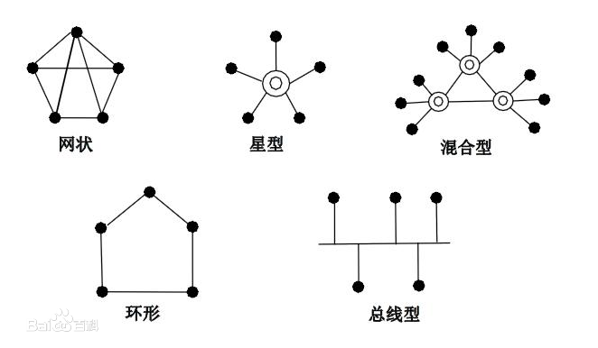
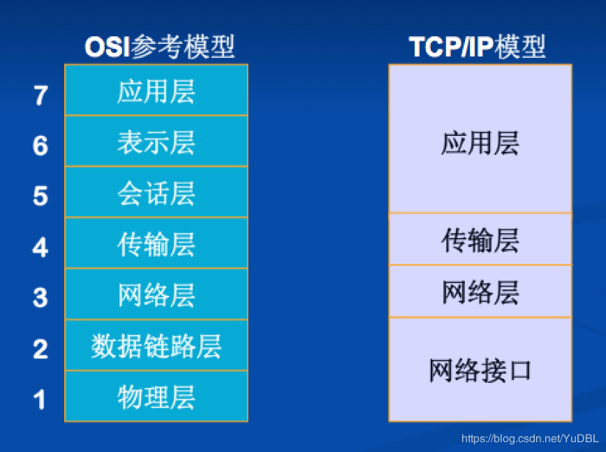

# 绪论

## 概述

### 计算机网络概念

* 计算机网络就是一些互联的，自治的计算机系统集合（最简洁定义）
* 能够实现远程信息处理的系统或进一步达到资源共享的系统（广义观点）
* 以能够相互共享资源的方式互联起来的，自治的计算机系统的集合（资源共享观点）
  * 目的：资源共享
  * 组成单元：分布在不同地理位置的多台独立的“自治计算机”
  * 网络中计算机统一遵循的规则：网络协议
* 能够为用户自动管理资源的网络操作系统，它能调用用户所需要的资源，整个网络像一个大的计算机系统一样对用户透明（用户透明性观点）

### 计算机网络组成

#### 物理组成

* 硬件：
  * 主机
  * 通信处理机（前端处理器，如网卡）
  * 通信线路（有线线路和无线线路等，如双绞线，光纤等）
  * 交换设备（交换机等连接设备）
* 软件：实现资源共享和方便用户使用的各种工具软件（如FTP等）
* 协议：通信规则

#### 工作方式组成

* 边缘部分：用户直接使用的主机（用于通信和资源共享）
* 核心部分：网络及连接这些网络的路由器

#### 功能组成

* 通信子网（包括物理层，数据链路层，网络层）：
  * 传输介质
  * 通信设备
  * 网络协议
* 资源子网：实现资源共享的设备及软件的集合

### 计算机网络功能

* 数据通信
  * 连接控制
  * 传输控制
  * 差错控制
  * 流量控制
  * 路由选择
  * 多路复用
* 资源共享
  * 数据资源
  * 软件资源
  * 硬件资源
* 分布式处理
* 信息综合处理
* 负载均衡
* 提高可靠性

### 计算机网络分类

#### 分布范围

* 广域网（因特网的核心）
* 城域网
* 局域网
* 个人区域网

#### 传输技术

* 广播式网络
* 点对点网络

#### 拓扑结构

* 星型网络
* 总线型网络
* 环形网络
* 网状型网络

#### 使用者

* 公用网（公众网）
* 专用网

#### 交换技术

* 电路交换网络
* 报文交换网络（存储-转发网络）
* 分组交换网络（包交换网络，目前主流网络）

#### 传输介质

* 无线
  * 蓝牙
  * 微波
  * 无线电
* 有线
  * 双绞线网络
  * 同轴电缆网络
  * 光纤网络

### 计算机网络标准化工作及相关组织

#### RFC上升为因特网标准步骤

1. 因特网草案
2. 建议标准（此时成为RFC文档）
3. 草案标准
4. 因特网标准

#### 标准化组织

* 国际标准化联盟（ISO）
  * OSI参考模型
  * HDLC
* 国际电信联盟(ITU)，前身为国际电话电报咨询委员会（CCITT）
* 国际电气电子工程师协会（IEEE）

### 计算机性能指标

#### 时延

* 发送时延（传输时延）：主机或路由器发送数据帧所需要的时间
  $$
  发送时延=数据帧长度/发送速率
  $$

* 传播时延：电磁波在信道中传输花费的时间
  $$
  传播时延=信道长度/电磁波传播速度
  $$

* 处理时延（一般忽略）：主机或路由器接到分组时处理所花费的时间

* 排队时延（一般忽略）：分组在路由器中排队等待的时间

**计算公式**
$$
总时延=发送时延+传播时延+处理时延+排队时延
$$
特别的，对于分组传输，在计算其在各个交换机上的发送时延时，只需计算单个分组

如，连续发送**n**个长度为**l**的分组，途径**k**个交换机（即存在**k+1**条链路)，每条链路传播时延为**d**，每台主机或交换机发送速率为**m**，那么在不考虑处理时延和排队时延的情况下，总时延为：
$$
总时延=\frac{n*l}{m}+\frac{l}{m}*k+(k+1)*d
$$

#### 时延带宽积

* 发送端发送的第一个比特到达终点时发送端发送的比特数
  $$
  时延带宽积=传播时延*通信带宽
  $$

#### 往返时间（RTT）

* 发送方发送数据开始到收到接收方确认消息时，共经历的时间

#### 利用率

* 信道利用率
  $$
  信道利用率=有数据通过的时间/总时间
  $$

* 网络利用率：全网络信道利用率的加权平均值

**注**：

* 利用率越高不代表网络运行状态越好，利用率高时转发时延也会增加

#### 吞吐量

* 单位时间内通过某信道/网络/接口的数据量

#### 速率

* 主机在数字信道上传送数据的速率
* **最高速率**也称为**带宽**

## 计算机体系结构与参考模型

### 术语

* 实体：任何课发送或接受信息的硬件或软件进程
* 对等层：不同机器上的同一层
* 对等实体：同一层上的实体

### 协议

* 控制两个对等实体进行通信的规则
* 协议是水平的

#### 组成

* 语义：构成协议元素的的含义的解释
* 语法：数据和控制信息的格式
* 同步：规定事件执行顺序

### 接口（服务访问点）

向上一层提供服务访问点

* 服务数据单元（SDU）

* 协议控制信息（PCI）

* 接口控制信息（ICI）

* 协议数据单元（PDU）（对等实体间传输的数据单元）
  $$
  PDU_n=PCI_n+SDU_n=SBU_{n-1}
  $$
  
* 接口数据单元（IDU）(相邻层传输的数据单元)
  $$
  IDU_n=ICI_n+SDU_n
  $$

### 服务

* 下层为相邻上层提供的功能调用

* 服务是垂直的

#### 服务类型

* 以是否连接区分

  | 服务       | 优点                     | 缺点                           | 实例    |
  | ---------- | ------------------------ | ------------------------------ | ------- |
  | 面向连接   | 可靠信息流，信息回复确认 | 占有通信信道                   | TCP     |
  | 面向无连接 | 不占用通信信道           | 信息流可能丢失，信息无回复确认 | IP，UDP |

* 按是否应答区分

  * 有应答服务
  * 无应答服务

* 按是否可靠区分

  * 可靠服务：具有检错、纠错、应答机制，保证数据正确可靠地送达
  * 不可靠服务：尽量正确可靠地送达数据，不保证数据正确可靠

#### 服务原语

* 请求：服务用户->服务提供者（请求完成某项工作）
* 指示：服务提供者->服务用户（指示用户做某事）
* 响应：服务用户->服务提供者（作为指示的响应）
* 证实：服务提供者->服务用户（作为对请求的证实）

### ISO/OSI参考模型

* 共七层

  0. 物理媒体（传输信息使用的通信介质）

  1. 物理层
     * 基本单位：比特（bit）
     * 硬件：集线器，中继器
     * 功能：规定了通信接口的参数（如尺寸，形状等），规定了传输信号的意义和电气特征（如低电平代表0，高电平代表1等）
     * 接口标准：EIA-232C，EIA/TIA RS 449，CCITT的X.21等
  2. 数据链路层
     * 基本单位：帧
     * 硬件：交换机，网桥
     * 功能：链路连接的建立、拆除、分离， 帧定界和帧同步， 差错检测
     * 协议：PPP，HDLC
  3. 网络层
     * 基本单位：数据报
     * 硬件：路由器
     * 功能：组包和拆包，路由选择，拥塞控制
     * 协议：ICMP（传输出错报告控制信息，IP的子协议），ARP（IP转MAC），RARP（MAC转IP），IP，IGMP（组播）
  4. 传输层
     * 基本单位：报文段（TCP），用户数据报（UDP）
     * 硬件：路由器
     * 功能：端到端的可靠传输服务，流量控制，差错控制，服务质量管理
     * 协议：TCP，UDP，ARQ
  5. 会话层
     * 任务：在两节点间建立连接
  6. 表示层
     * 任务：处理通信数据表示格式
  7. 应用层
     * 协议：FTP，SMTP，POP3，HTTP等

### TCP/IP模型

只包含四层

1. 网络接口层
2. 网络层
3. 传输层
4. 应用层

### TCP/IP模型与ISO/OSI参考模型对比

| OSI参考模型                                                  | TCP/IP模型                                                   |
| ------------------------------------------------------------ | ------------------------------------------------------------ |
| 1. 区分服务，接口，协议 2. 产生于协议发明前 3. 协议具有良好的隐蔽性 4. 共有7层 5. 网络层：有连接和无连接 6. 传输层：仅面向连接 | 1. 没有明确区分服务，接口，协议 2. 产生在协议发明后 3. 共有4层 4. 网络层：仅有无连接 5. 传输层：面向连接和无连接 |

## 其他零散知识

* 第一个计算机网络是：ARPAnet

* OSI模型中，第一个提供端到端通信的是传输层